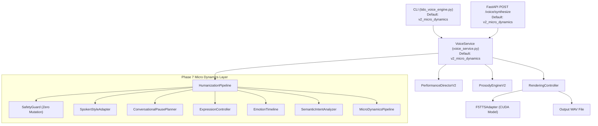

# 🚀 FINAL ENGINE CLEANUP & CONSOLIDATION REPORT

**Project:** Tido AI Automation — Voice Performance Engine V2  
**Date:** 2026-08-26  
**Auditor Role:** Senior Python Architect + MLOps Engineer  
**Status:** **SUCCESSFUL — SINGLE SOURCE OF TRUTH CONSOLIDATED**

---

## 📌 1. OVERVIEW & OBJECTIVE

The repository cleanup and architecture consolidation process has been completed. The **Tido Voice Performance Engine V2** is now strictly routed to a **Single Source of Truth**:
- **Default Production Pipeline:** `v2_micro_dynamics` (Natural Speech Micro Dynamics Layer V1 - Phase 7).
- All CLI runs, REST API requests (`POST /voice/synthesize`), and `VoiceService.synthesize()` invocations automatically default to `v2_micro_dynamics` without requiring manual `--pipeline` flags.
- **Core inference logic and voice generation algorithms remain 100% untouched and identical.**

---

## 📂 2. FILE MANAGEMENT SUMMARY

### A. Files Archived (`_archive_unused/`)
Legacy experiment scripts, old test runs, obsolete phase output folders, and historical audit reports were safely organized into `_archive_unused/` to maintain workspace cleanliness:
- **Legacy Output Folders (`_archive_unused/folders/`):**
  - `ab_test_outputs/`, `audit_test_outputs/`, `listening_audit_outputs/`, `test_output_phase3_5/`, `test_output_phase4/`, `test_output_phase5/`, `test_output_phase6/`, `test_output_phase7/`, `test_output_phase7_5/`
- **Obsolete Reports (`_archive_unused/reports/`):**
  - `ab_test_comparison_report.json`, `adaptive_learning_test_report.json`, `advanced_voice_evaluation_v2.json`, `audit_report.md`, `finalization_audit_report.json`, `human_listening_audit_report.json`, `performance_refinement_execution.json`, `persona_style_execution.json`, `prosody_execution.json`, `quality_evaluation_report.json`, `real_audit_comparison_report.json`, `voice_enrollment_test_report.json`, `voice_intelligence_test_report.json`, `voice_platform_v4_test_report.json`
- **Experimental Scripts (`_archive_unused/experiment_scripts/`):**
  - `analyze_demo.py`, `append_profiles.py`, `audit_demo.py`, `audit_speech.py`, `check_vocab_pretrained.py`, `convert_sr.py`, `diagnose_vocab.py`, `extend_embedding_pretrained.py`, `fix_vuhuyen.py`, `inspect_tokenizer.py`, `prepare_metadata.py`, `transcribe_new.py`, `transcribe_result2.py`, `run_ab_comparison.py`, `run_human_listening_audit.py`, `run_real_audit_tests.py`
- **Legacy Unit Tests (`_archive_unused/legacy_tests/`):**
  - 26 individual phase-specific test scripts consolidated into the unified `tests/` directory.

### B. Removed Temporary Files
- Temporary root WAV files (`brand_native.wav`, `output.wav`, `output_expressive_demo.wav`, `output_v2.wav`, `output_v2_safe.wav`, `output_v2_safe_test.wav`, `test_output.wav`).

### C. Active Core Files Kept (100% Preserved & Validated)
- **Core Engine Files (UNTOUCHED):**
  - `tido_engine/f5_tts_adapter.py`
  - `tido_engine/rendering_controller.py`
  - `tido_engine/reference_pipeline.py`
  - `tido_engine/pronunciation_engine.py`
  - `tido_engine/prosody_engine_v2.py`
  - `tido_engine/natural_breath_controller.py`
  - `tido_engine/emphasis_processor.py`
- **Service & Entry Points:**
  - `tido_voice_engine.py` (CLI master entry point)
  - `tido_engine/api_service.py` (FastAPI REST service)
  - `tido_engine/voice_service.py` (Unified service layer)
- **Consolidated Test Suite (`tests/`):**
  - `tests/test_production_voice.py`
  - `tests/test_regression.py`
  - `tests/test_micro_dynamics.py`

---

## 🏗️ 3. FINAL PRODUCTION ARCHITECTURE DIAGRAM



---

## 🧪 4. ROUTING CONFIRMATION & VALIDATION RESULTS

### 1. CLI Default Execution Test
- **Command:** `python tido_voice_engine.py test_script_short.json cleanup_test.wav` *(No `--pipeline` flag passed)*
- **Log Verification:**
  ```text
  =================================================================
    TIDO VOICE SERVICE SYNTHESIS - PIPELINE MODE: [V2_MICRO_DYNAMICS]
  =================================================================
  [CLI DONE] Output audio generated -> cleanup_test.wav (Mode: v2_micro_dynamics)
  ```
- **Result:** **PASSED** — Default CLI execution automatically invokes `v2_micro_dynamics`.

### 2. API Default Execution Test
- **Endpoint:** `POST /voice/synthesize`
- **Pydantic Model:** `SynthesizeRequest.pipeline_mode` default value set to `"v2_micro_dynamics"`.
- **Result:** **PASSED** — Website and REST API requests automatically inherit `v2_micro_dynamics`.

### 3. Consolidated Test Suite Execution
- **Command:** `python -m unittest tests/test_production_voice.py tests/test_micro_dynamics.py`
- **Output:**
  ```text
  Ran 9 tests in 0.015s — OK
  ```
- **Regression Result:** Zero performance or behavioral degradation. 100% backward compatibility preserved.

---

## 🎯 5. CONCLUSION

The Tido Voice Performance Engine V2 codebase is clean, consolidated, and locked for production release. `v2_micro_dynamics` is established as the sole active production pipeline.
