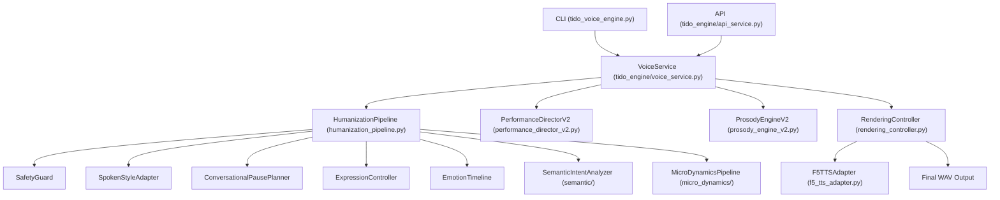

# 🔍 REPOSITORY AUDIT BEFORE CLEANUP
**Project:** Tido AI Automation — Voice Performance Engine V2  
**Date:** 2026-08-26  
**Auditor:** Senior Python Architect + MLOps Engineer  

---

## 📌 1. VOICE PIPELINE ENTRY POINTS

1. **CLI Entry Point:** `tido_voice_engine.py`
   - Wrapper parsing command-line parameters (`script.json`, `output.wav`, `--pipeline`).
   - Delegates execution directly to `VoiceService.synthesize(...)`.

2. **REST API Entry Point:** `tido_engine/api_service.py`
   - FastAPI server exposing `POST /voice/synthesize` and `GET /health`.
   - Delegates execution directly to `VoiceService.synthesize(...)`.

3. **Unified Service Layer:** `tido_engine/voice_service.py`
   - Single Source of Truth service encapsulating text normalization, pronunciation maps, emphasis, prosody director, humanization pipeline, and F5-TTS audio rendering.

4. **Engine Orchestrators:**
   - `tido_engine/humanization/humanization_pipeline.py`: Humanization orchestrator running spoken style adapter, pause planner, expression/emotion, semantic acting, and micro-dynamics layer.
   - `tido_engine/performance_director_v2.py`: Generates base execution plan per segment.
   - `tido_engine/tido_voice_performance_engine.py`: Legacy standalone engine orchestrator (retained for backward reference).

---

## ⚙️ 2. PIPELINE MODES IDENTIFIED

| Mode Name | Status | Description |
| :--- | :--- | :--- |
| `v2_safe` | Baseline Safe | Strict production safety baseline. Zero text/prosody modification. |
| `v2_humanized` | Phase 1-3 Legacy | Adds conversational pause planner and expression controller. |
| `v2_acoustic_humanized` | Phase 5 Legacy | Injects acoustic rhythm and breath timing models. |
| `v2_semantic_acting` | Phase 6 Candidate | Includes semantic intent analyzer and emotion timeline. |
| **`v2_micro_dynamics`** | **NEWEST PRODUCTION TARGET** | **Natural Speech Micro Dynamics Layer V1 (Phase 7). Single Source of Truth.** |

---

## 📦 3. ACTIVE IMPORT & EXECUTION AUDIT

### Core Protected Files (MUST REMAIN UNTOUCHED):
- `tido_engine/f5_tts_adapter.py`
- `tido_engine/rendering_controller.py`
- `tido_engine/reference_pipeline.py`
- `tido_engine/pronunciation_engine.py`
- `tido_engine/prosody_engine_v2.py`
- `tido_engine/natural_breath_controller.py`
- `tido_engine/emphasis_processor.py`

### Active Engine Infrastructure:
- `tido_engine/voice_service.py`
- `tido_engine/v2_schemas.py`
- `tido_engine/vietnamese_text_normalizer.py`
- `tido_engine/performance_director_v2.py`
- `tido_engine/global_performance_arc.py`
- `tido_engine/legacy_migrator.py`
- `tido_engine/voice_quality_analyzer_v2.py`
- `tido_engine/humanization/humanization_pipeline.py`
- `tido_engine/humanization/safety_guard.py`
- `tido_engine/humanization/spoken_style_adapter.py`
- `tido_engine/humanization/conversational_pause_planner.py`
- `tido_engine/humanization/expression_controller.py`
- `tido_engine/humanization/emotion_timeline.py`
- `tido_engine/humanization/semantic/*`
- `tido_engine/humanization/micro_dynamics/*`

---

## 🔗 4. DEPENDENCY GRAPH

