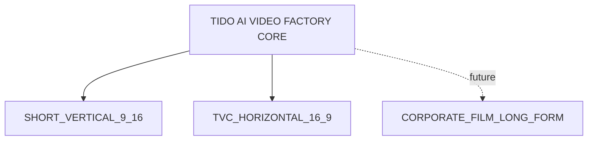
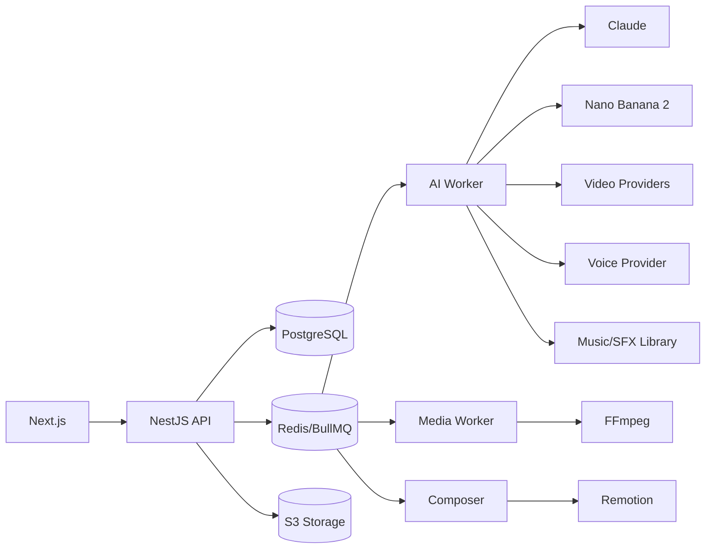
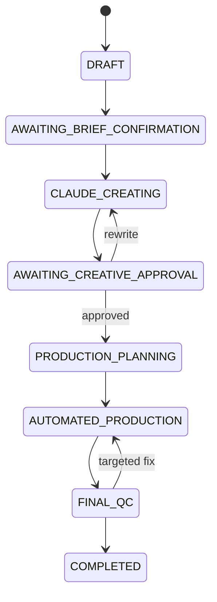

# TIDO AI VIDEO FACTORY — MASTER CONTEXT FOR CLAUDE CODE

---

# TIDO AI Video Factory — Claude Code Starter Pack

Bộ tài liệu này là nguồn chuẩn để Claude Code phân tích, lập kế hoạch và xây dựng **TIDO AI Video Factory Version 1**.

## Hai Production Profile

### 1. Short Vertical 9:16
- TikTok, Facebook Reels, YouTube Shorts
- 1080 × 1920
- 15 hoặc 30 giây trong MVP

### 2. TVC Horizontal 16:9
- TVC ngắn, digital commercial, YouTube, website, digital screen
- 1920 × 1080
- 15 hoặc 30 giây trong MVP

> PDN/phim doanh nghiệp dài chưa thuộc Version 1. Kiến trúc phải cho phép thêm profile long-form riêng sau này.

## Quyết định đã khóa

- Stage 1 do người dùng nhập, kiểm tra và xác nhận; không dùng AI để suy luận dữ liệu kinh doanh.
- Stage 2 dùng Claude.
- Bước 7 là user approval bắt buộc trước production.
- Toàn bộ ảnh AI chỉ dùng Nano Banana 2.
- Nhạc được chọn động theo từng project; không dùng một track mặc định.
- Kho giọng công ty được dùng để render lời thoại mới theo kịch bản.
- Kiến thức quay, ánh sáng, directing, editing, audio của TIDO được cấu trúc thành Production Technique Cards.
- Mỗi scene là một job độc lập.
- Logo, giá, ưu đãi, CTA, subtitle và legal text luôn dựng bằng code/template.
- Không xây hai backend riêng cho 9:16 và 16:9; dùng Core System + Production Profile.
- PostgreSQL là source of truth.
- Mọi model, capability và giá phải nằm trong Model Registry, không hard-code.

## Bắt đầu

1. Đọc `CLAUDE.md`.
2. Đọc `docs/00-master-system-spec.md`.
3. Đọc `docs/99-open-decisions.md`.
4. Không code ngay; trước tiên tạo ADR, kế hoạch phase, risk register và acceptance criteria.
5. Chỉ triển khai Phase 0 sau khi các open decision quan trọng được xác nhận.

---

# CLAUDE.md — TIDO AI Video Factory

@docs/00-master-system-spec.md
@docs/01-core-architecture.md
@docs/02-system-flow.md
@docs/03-short-video-profile.md
@docs/04-tvc-profile.md
@docs/05-production-brain.md
@docs/06-voice-music-sfx.md
@docs/07-qc-cost-reliability.md
@docs/08-data-model-and-api.md
@docs/09-implementation-roadmap.md
@docs/10-acceptance-criteria.md
@docs/99-open-decisions.md

## Vai trò

Bạn là Principal Software Architect, Senior Full-stack Engineer, AI Platform Engineer và Media Pipeline Engineer.

## Quy tắc bắt buộc

1. Không code toàn bộ hệ thống trong một lần.
2. Trước mỗi phase phải liệt kê assumption, open decision, risk, implementation plan và acceptance criteria.
3. Không tự thay đổi quyết định sản phẩm đã khóa.
4. Không thêm AI reasoning vào Stage 1.
5. Không thêm image provider ngoài Nano Banana 2.
6. Không dùng một bài nhạc cố định cho nhiều project.
7. Claude chỉ tạo `voice_requirements`; Voice Selection Engine mới chọn `voice_id`.
8. Không để AI image/video tạo logo, giá, CTA, subtitle hoặc legal text.
9. Không tạo hai hệ thống riêng cho 9:16 và 16:9.
10. Không hard-code model name, giá, quota hoặc capability.
11. Redis không phải source of truth.
12. Không submit lại provider job nếu đã có provider job ID.
13. Mỗi scene phải có version, cost cap, retry cap và QC result.
14. Thay đổi brief quan trọng phải invalidate các version phụ thuộc.
15. File provider phải được tải về storage của TIDO.

## Kiến trúc mặc định

- Monorepo.
- Frontend: TypeScript, React, Next.js.
- Backend: TypeScript, NestJS, modular monolith.
- AI worker: Python.
- Media worker: Python + FFmpeg.
- Composer: Remotion + FFmpeg.
- Database: PostgreSQL.
- Queue/cache: Redis + BullMQ.
- Storage: S3-compatible.
- Local development: Docker Compose.
- CI/CD: GitHub Actions.
- Observability: structured logs, error tracking, metrics và cost alerts.

## Repo boundaries

- `apps/web`: giao diện nội bộ.
- `apps/api`: domain API, auth, state, cost ledger, orchestration.
- `apps/composer`: Remotion compositions.
- `services/ai-worker`: Claude, Nano Banana 2, retrieval, prompt compilers, AI QC.
- `services/media-worker`: FFmpeg, probe, trim, audio mix, technical QC.
- `packages/contracts`: contracts được sinh từ schema.
- `packages/config`: production/platform/QC profiles.
- `packages/ui`: UI components.

## Quality gates

- TypeScript strict.
- Python type hints + Pydantic.
- OpenAPI.
- JSON Schema 2020-12.
- Unit tests cho domain.
- Contract tests cho adapters.
- Integration tests với mock providers.
- E2E project 15 giây bằng fake assets.
- Migrations rollback được.
- Job handlers idempotent.
- Không log secrets.

## Không thuộc MVP

- Public SaaS, billing, subscription.
- Auto-publish social.
- Mobile app.
- PDN long-form.
- Training custom foundation models.
- Kubernetes.
- GPU cluster.

---

# Master System Specification

## Product vision

TIDO AI Video Factory là hệ thống nội bộ biến brief thành video hoàn chỉnh. User bảo đảm dữ liệu đầu vào; Claude tạo creative; TIDO Production Brain cung cấp kỹ thuật; hệ thống tự sản xuất, QC và hậu kỳ.

## Product structure

## Core System

- Project/versioning
- Brief management
- Claude Creative Engine
- Creative approval
- Production Brain retrieval
- SceneSpecification base
- Production Planner
- Nano Banana 2 pipeline
- Voice Engine
- Music/SFX Engine
- Video Model Router
- Scene Quality Loop
- FFmpeg/Remotion Composer
- Final QC
- Cost Controller
- Audit log
- Analytics

## Locked decisions

1. Stage 1 do user kiểm soát.
2. Stage 2 dùng Claude.
3. Bước 7 là user approval.
4. Nano Banana 2 là image model duy nhất.
5. Voice lấy từ kho công ty.
6. Music được chọn riêng từng project.
7. Production Brain là nguồn kỹ thuật quay dựng.
8. Một scene là một job độc lập.
9. Core dùng chung cho 9:16 và 16:9.
10. V1 dùng nội bộ.
11. Brand graphics dựng deterministic.
12. Cost/quality đo theo usable output.

## MVP profiles

### Short Vertical
- 9:16, 1080 × 1920
- 15/30s
- TikTok/Reels/Shorts
- hook, retention, mobile text, platform safe zones
- Vertical Master + platform variants

### TVC Horizontal
- 16:9, 1920 × 1080
- 15/30s
- TVC ngắn/digital commercial
- wide composition, cinematic continuity, product hero, brand storytelling
- Horizontal Master + delivery variants

## Responsibility

| Layer | Owner |
|---|---|
| Business data | User |
| Creative treatment/script | Claude |
| Creative approval | User |
| Production knowledge | TIDO Production Brain |
| AI images | Nano Banana 2 |
| Voice selection | Voice Engine |
| Music selection | Music Engine |
| Video generation | Video Router |
| Scene QC | Quality Loop |
| Post-production | Remotion + FFmpeg |
| Final approval | User |

---

# Core Architecture

## Style

Modular monolith + background workers. Không dùng microservice/Kubernetes trong Version 1.

## Logical architecture

## Source of truth

- PostgreSQL: trạng thái, version, cost, QC.
- Redis: queue/cache/locks.
- S3: binary assets.
- API sở hữu state transition.
- Workers báo kết quả về API.
- Provider URLs chỉ là tạm thời.

## Core modules

Identity, Project, Brief, Creative, Production Brain, Scene, Asset, Provider Registry, Cost Ledger, Composer, QC, Admin/Debug.

## Reliability

- idempotency key;
- transaction/outbox;
- provider job ID lưu ngay sau submit;
- retry/backoff;
- circuit breaker;
- dead-letter;
- reconciliation;
- checksum;
- immutable versions;
- cost reserve;
- cancellation.

---

# System Flow — 3 Stages / 12 Steps

## Stage 1 — User Input & Control

1. Create project.
2. Enter brief/assets.
3. User checks and adjusts.
4. Confirm and lock brief.

Stage 1 không dùng AI reasoning. Hệ thống chỉ rule-validation.

## Stage 2 — Claude Creative Planning

5. Create Creative Treatment.
6. Create Script and Audio Direction.
7. User review and approval.
8. Create SceneSpecification từ Approved Script và Technique Cards.

## Stage 3 — Automated Production & Output

9. Production Planning.
10. Nano Banana 2, Voice, Music/SFX và Video Scene pipelines + Quality Loop.
11. Automatic Post-production.
12. Final QC and output variants.

## State machine

## Dependency invalidation

- Brief đổi lớn → invalidate treatment/script/scenes/plan.
- Script wording đổi → invalidate voice/timing liên quan.
- Voice đổi → không invalidate image/video.
- Music đổi → không invalidate image/video.
- Logo/price/CTA đổi → chỉ invalidate composition.
- Scene spec đổi → invalidate scene output và final output phụ thuộc.

---

# Production Profile — Short Vertical 9:16

## Output

- ID: `SHORT_VERTICAL_9_16_V1`
- 1080 × 1920
- 15/30s
- TikTok, Reels, Shorts
- Vertical Master + platform variants + clean version + poster

## Creative focus

First frame, hook, retention, pattern interrupt, mobile readability, sound-off comprehension, CTA, loop khi phù hợp.

## Scene extension

- vertical composition
- face/product scale
- safe zones
- platform UI exclusion
- caption zone
- first-frame role
- retention role
- pattern interrupt
- mobile text
- loop connection

## Production Brain extension

Vertical Cinematography, Hook, Retention & Pacing, Mobile Text, Platform Profiles, Vertical F&B Shots, Native Social Directing, Short-form Editing.

## Rules

- vertical-native;
- không tạo 16:9 rồi crop trừ fallback;
- model hỗ trợ 9:16 hoặc image-to-video từ keyframe dọc;
- scene thường 1 candidate;
- hook/hero tối đa 2;
- platform variants không render lại AI scenes.

## QC

First Frame, Hook, Retention, Mobile Readability, Sound-off, Loop, Platform Safe-zone, Vertical Technical, Product, Commercial, Audio.

---

# Production Profile — TVC Horizontal 16:9

## Scope

TVC ngắn, digital commercial, product advertising, brand spot, YouTube, website, digital screen. Không bao phủ PDN dài.

## Output

- ID: `TVC_HORIZONTAL_16_9_V1`
- 1920 × 1080
- 15/30s
- Horizontal Master + YouTube/Website/Digital Screen/Clean/Poster variants

## Creative focus

Brand world, narrative entry, product experience, cinematic composition, visual continuity, premium lighting, emotional progression, hero product, brand resolution.

## Scene extension

- wide composition
- horizontal blocking
- foreground/background layers
- cinematic continuity
- brand world consistency
- hero fidelity
- title/broadcast safe
- delivery profile

## Production Brain extension

Wide Cinematography, TVC Narrative, Brand Storytelling, Premium Product Lighting, Horizontal F&B Shots, TVC Editing, Delivery Profiles, Legal/Disclaimer Layout.

## QC

Narrative opening, brand consistency, cinematic continuity, product hero, wide composition, title safe, legal, color/audio/delivery technical.

---

# TIDO Production Brain

## Purpose

Biến kinh nghiệm production của TIDO thành dữ liệu có cấu trúc để Claude và Production Planner chọn đúng kỹ thuật cho từng scene.

## Core libraries

- Cinematography
- Lighting
- F&B Shot
- Directing
- Editing
- Audio
- AI Production

## Profile extensions

### Short Vertical
Vertical framing, hook, retention, mobile text, platform UI, UGC/social-native.

### TVC Horizontal
Wide composition, brand narrative, premium lighting, cinematic pacing, delivery profile.

## Retrieval

Input:
- scene purpose
- product type
- production profile
- visual style
- emotion
- budget
- provider limits

Output:
- 5–15 Technique Cards phù hợp;
- lý do chọn;
- constraints;
- fallback.

## Governance

- card có version và owner;
- card mới cần review;
- archive thay vì delete;
- lưu card IDs trong SceneSpecification;
- đo pass rate/cost/retry/approval theo card;
- Version 1 dùng retrieval + rule, chưa train model riêng.

## Minimum fields

- technique ID/version/name/category
- purpose
- suitable/not suitable
- profile tags
- camera/lighting/action setup
- expected result
- common failures
- QC criteria
- provider hints
- fallback
- status/owner

---

# Voice, Music and SFX

## Voice

Claude không chọn voice ID. Claude tạo Voice Requirements.

### Requirements
- language/accent
- perceived gender/age
- tone
- energy/warmth/authority
- emotional range
- pace
- profile suitability
- hook strength
- CTA authority

### Voice profile
- voice ID/provider/providerVoiceId
- license
- language/accent
- style/industry/profile tags
- pace range
- emotional range
- quality score
- historical approval

### Flow
1. Claude tạo requirements.
2. Engine lọc language/license.
3. Engine chấm điểm.
4. Có thể preview Top candidates ở bước 7.
5. User duyệt/chọn.
6. Performance Director tạo emotion, pace, pause, emphasis, pronunciation, target duration.
7. Provider render.
8. Voice QC.
9. Retry cùng voice hoặc voice thứ hai.
10. Speech-to-speech chỉ khi provider/license hỗ trợ.

### Open decision
Xác minh kho giọng hiện là voice IDs/models có API hay chỉ audio samples. Audio sample đơn thuần không tự đọc lời thoại mới.

## Music

Không có default track cho mọi project.

### Music Brief
- genre/mood/BPM/key
- instrumentation
- energy curve
- intro impact
- product reveal
- CTA point
- voice compatibility
- loop compatibility
- avoid list

### Source priority
1. customer-provided
2. TIDO licensed
3. licensed commercial library
4. generated/custom
5. producer/composer premium

### Track metadata
Track ID, source, genre, mood, BPM, key, duration, energy, instruments, vocal flag, intro/drop/loop points, license, expiry, restrictions, history.

## SFX

SFX pipeline riêng: action cue, material, distance, intensity, timing, license, ducking.

## Cache keys

- voice = script version + voice ID + performance version
- music edit = track ID + timeline version + mix version
- SFX = source ID + cue version

---

# QC, Cost and Reliability

## QC layers

### Technical
File, codec, resolution, duration, corrupt/black/freeze frames, audio corruption.

### Product
Packaging, label, color, shape, count, proportion, no invented text.

### Cinematography
Shot size, angle, movement, lens feel, composition, focus.

### Lighting
Direction, contrast, temperature, highlights, reflections, consistency.

### Physics/action
Gravity, liquids, hands, interaction, timing, continuity.

### Audio
Pronunciation, content, emotion, pace, clipping/noise, mix, ducking.

### Commercial
Product visibility, appetite appeal, message, CTA, brand fit.

### Profile-specific
- Short: first frame, hook, retention, mobile, sound-off, loop, safe zones.
- TVC: cinematic continuity, brand world, hero, title safe, delivery.

## QC decisions

- accept
- retry same provider
- retry revised prompt
- fallback provider
- fallback production method
- manual review
- reject

## Retry

Default: initial attempt + one prompt/reference revision + one provider fallback. Không retry vô hạn.

## Cost ledger

Lưu estimate, reserve, actual, retry, failed attempt, provider/model, pricing snapshot, usable seconds.

Primary metrics:
- cost per usable second
- cost per approved project

## Reliability

- idempotency;
- provider job ID persisted immediately;
- transaction/outbox;
- backoff/circuit breaker;
- dead-letter;
- reconciliation;
- checksum;
- immutable versions;
- provider URL ingestion;
- resume after restart;
- cancellation;
- cost reservation.

## Metrics

First-pass rate, fallback pass rate, image pass rate, voice/music first-choice rate, cost/usable second, latency, provider errors, manual review, approval within two versions.

---

# Data Model and API

## Entities

Workspace, User, Client, Brand, Product, Project, ProjectVersion, ProductionProfile, BriefVersion, CreativeTreatmentVersion, ScriptVersion, CreativeApproval, Scene, SceneSpecificationVersion, TechniqueCard, TechniqueCardVersion, Asset, AssetDerivative, ProductionPlan, Provider, ProviderModel, ProviderCapability, PricingSnapshot, GenerationJob, JobAttempt, QCRecord, VoiceProfile, VoiceRender, MusicTrack, MusicEdit, SFXAsset, TimelineVersion, OutputVersion, CostLedgerEntry, AuditLog.

## Relationships

- Project có một active Production Profile.
- Versions immutable.
- Approved Script tham chiếu locked Brief.
- SceneSpecification tham chiếu Approved Script và Technique Card versions.
- Production Plan tham chiếu SceneSpec và Pricing Snapshot.
- Generation Job chỉ thuộc một scene version.
- Output tham chiếu chính xác scene/audio/graphic/timeline versions.

## Commands

CreateProject, UpdateBriefDraft, ConfirmBrief, GenerateCreative, ReviseCreative, ApproveCreative, BuildSceneSpecifications, PlanProduction, StartProduction, RetryScene, SelectFallback, ComposeOutput, RunFinalQC, ApproveOutput, CreateVariant, CancelProject.

## Events

BriefConfirmed, CreativeGenerated, CreativeApproved, SceneSpecificationsCreated, ProductionPlanned, SceneJobSubmitted, SceneJobCompleted, SceneQCFailed, SceneAccepted, VoiceRendered, MusicSelected, CompositionCompleted, FinalQCCompleted, ProjectCompleted.

## API conventions

- REST + OpenAPI trong MVP.
- idempotency key.
- optimistic concurrency.
- cursor pagination.
- signed upload/download.
- internal worker authentication.
- normalized errors: code/category/retryable/userMessage.

---

# Implementation Roadmap

## Phase 0 — Foundation
Monorepo, Docker Compose, CI, lint/typecheck/test, OpenAPI, schema validation, mock providers, ADR, secrets.

Exit: services boot, CI pass, fake queued job chạy end-to-end.

## Phase 1 — Domain Core
Project, profiles, brief versions, approval, state machine, scene spec, cost skeleton, audit.

Exit: create/confirm brief, approve mocked creative, invalid transitions rejected.

## Phase 2 — Claude + Production Brain
Claude adapter, structured output, prompt versioning/cache, technique cards, retrieval, treatment/script/scenes.

Exit: locked brief tạo output valid; revision flow hoạt động.

## Phase 3 — Nano Banana 2
Adapter, references, versions, cache/dedupe, image QC, compositing fallback.

Exit: scene tạo approved keyframe và ghi cost.

## Phase 4 — Video Framework
Registry, adapter contract, mock provider, real provider 1, fallback provider, reconciliation, scene QC, footage selection.

Exit: scene complete/fail/retry/fallback độc lập.

## Phase 5 — Voice
Audit kho giọng, profiles, scoring, preview, performance direction, rendering, QC/cache.

Exit: approved script tạo timed voice file.

## Phase 6 — Music/SFX
Library ingestion, metadata, license, scoring, edit points, cues.

Exit: nhạc/SFX được chọn riêng từng project.

## Phase 7 — Composer
Remotion, FFmpeg, subtitles, graphics, profile layout, mix, master/variants.

Exit: output MP4 cho cả hai profile.

## Phase 8 — Final QC/Pilot
Profile QC, analytics, admin debug, alert, manual review, benchmark/pilot.

Exit: KPI nội bộ đạt ngưỡng.

---

# Acceptance Criteria

## Product
- Tạo project Short hoặc TVC.
- Stage 1 không AI reasoning.
- User confirm brief.
- Claude output versioned/reviewable.
- Approval bắt buộc trước production.
- Nano Banana 2 là AI image provider duy nhất.
- Voice chọn từ kho công ty.
- Music chọn per-project.
- Scene retry độc lập.
- Brand graphics deterministic.

## Reliability
- Resume sau restart.
- Không duplicate provider submit/cost.
- Một scene lỗi không fail project.
- Provider URLs được ingest.
- Dead-letter/reconciliation hoạt động.

## Quality targets
- first-pass scene ≥ 65% sau benchmark;
- after fallback ≥ 90%;
- product accuracy ≥ 90%;
- logo/price/CTA error = 0;
- no-manual-edit ≥ 80%;
- estimate variance ≤ 15%;
- technical completion ≥ 95%;
- approval within two versions ≥ 80%.

## Short
1080×1920, vertical-native, safe zones, mobile text, first-frame/hook/retention QC, Vertical Master + variants.

## TVC
1920×1080, wide composition, cinematic continuity, hero QC, Horizontal Master + variants.

## Security
Server-side keys, signed URLs, workspace isolation, roles, audit, no secret logs, preserve license metadata.

---

# Open Decisions

## Product
1. Build cả hai profile ngay hay Short trước?
2. TVC có broadcast hay chỉ digital?
3. PDN long-form đã được xác nhận out of scope?
4. Brand/Product Library có trong MVP đầu?
5. Quality tier hiển thị cho user hay chỉ admin?

## Claude
6. Model/deployment route cụ thể?
7. Output/cost cap?
8. Prompt versioning?
9. Production Brain retrieval: PostgreSQL full-text, pgvector hay service riêng?

## Voice
10. Kho voice là voice IDs/models hay audio samples?
11. Provider?
12. License/cloning rights?
13. Emotion/SSML/speech-to-speech?
14. User duyệt voice bắt buộc hay theo confidence?

## Music
15. Kho nhạc và metadata/license?
16. Stems/loop points/waveform?
17. Paid social/broadcast rights?
18. Generated music có trong MVP?

## Video
19. Hai provider đầu tiên?
20. Fallback provider?
21. Capability 9:16/16:9, I2V, start/end frame, audio?
22. Cost cap?
23. Hero scene có human review?

## Infrastructure
24. Cloud?
25. S3?
26. Auth?
27. Deployment?
28. Retention?
29. Max asset?
30. Observability?
31. Budget?
32. Backup/RPO/RTO?

## Compliance
33. Customer data policy?
34. Asset license?
35. Face/voice rights?
36. Claim/legal approval?
37. Provider retention/opt-out?

---

# Prompt khởi động

Hãy đọc toàn bộ `CLAUDE.md` và các file được import.

Nhiệm vụ:
1. Không code ngay.
2. Kiểm tra tính nhất quán.
3. Báo cáo:
   - kiến trúc bạn hiểu;
   - quyết định đã khóa;
   - open decisions;
   - mâu thuẫn/thiếu sót;
   - repo tree;
   - ADR;
   - kế hoạch Phase 0/1;
   - risk register;
   - acceptance criteria.
4. Kiểm tra đặc biệt:
   - Core có thực sự dùng chung 9:16/16:9;
   - SceneSpecification base + profile extension;
   - dependency invalidation;
   - kho voice là model hay sample;
   - provider abstraction;
   - cost ledger;
   - idempotency/reconciliation;
   - deterministic graphics.
5. Dừng và chờ xác nhận trước khi code.

Không thay đổi các quyết định đã khóa.
