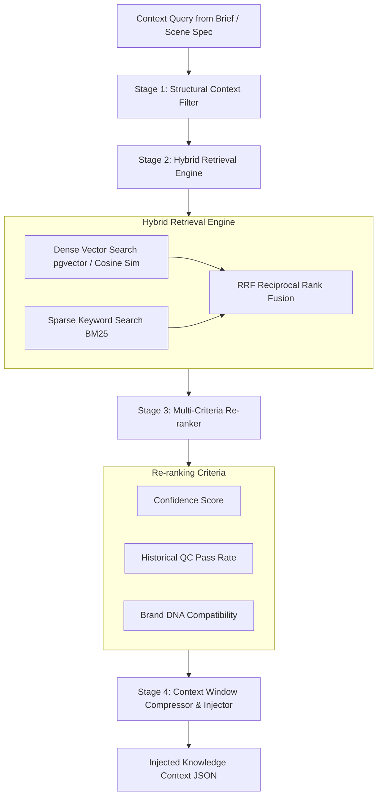

# TIDO CREATIVE OS — KNOWLEDGE INTELLIGENCE LAYER V1 ARCHITECTURE SPECIFICATION

> **Document Version:** 1.0.0  
> **System Layer:** Layer 2 — Creative Intelligence (TIDO Creative OS)  
> **Author Roles:** Senior AI System Architect | Senior Full-stack Engineer | Senior MLOps Engineer | Senior SaaS Product Architect | Senior Marketing Technology Architect  
> **Date:** August 27, 2026  
> **Status:** ARCHITECTURE DESIGN APPROVED — READY FOR EXTENSION  

---

## 1. KNOWLEDGE BASE FOLDER ARCHITECTURE

Kiến trúc thư mục lưu trữ tri thức của **TIDO Knowledge Intelligence Layer V1** được thiết kế mở rộng (scalable) theo tiêu chuẩn Monorepo Package (`packages/knowledge-base`), phân tách rõ ràng giữa Schemas, Domain Knowledge, Technique Cards, Brand DNA và Vector Indexes.

```
packages/knowledge-base/
├── README.md
├── package.json
├── index.ts
│
├── schemas/                                 # JSON Schemas & TypeScript Definitions
│   ├── knowledge-node.schema.json           # Schema tổng quát cho mọi nút tri thức
│   ├── technique-card.schema.json           # Schema cho Production Technique Card
│   ├── brand-dna.schema.json                # Schema định danh thương hiệu (Brand DNA)
│   └── context-query.schema.json            # Schema truy vấn ngữ cảnh (Context Query)
│
├── domains/                                 # Cấu trúc tri thức theo Domain
│   ├── marketing/                           # Marketing & Advertising Knowledge
│   │   ├── positioning/                     # Brand positioning, Value props, Angles
│   │   ├── audience_personas/               # Customer profiles, pain points, triggers
│   │   ├── campaign_objectives/             # Awareness, Conversion, Retention plays
│   │   └── channel_playbooks/               # TikTok/Reels, TVC, YouTube, Facebook rules
│   │
│   ├── creative_direction/                  # Creative & Visual Art Direction
│   │   ├── visual_styles/                   # Cinematic, Minimalist, Cyberpunk, Commercial
│   │   ├── color_harmonies/                 # Warm tones, High contrast, Brand match
│   │   ├── typography_rules/                # Readability, Safe-zones, Caption placement
│   │   └── hook_mechanics/                  # Pattern interrupts, Visual hooks, Retention cues
│   │
│   ├── cinematography/                      # Camera & Lighting Technique Cards
│   │   ├── framing_composition/             # Rule of thirds, Golden ratio, Macro hero shots
│   │   ├── lighting_setups/                 # 3-point lighting, Moody key light, Soft glow
│   │   └── camera_movement/                 # Push-in, Orbit, Tracking, Whip-pan
│   │
│   └── audio_directing/                     # Voice & Audio Production Direction
│       ├── voice_styles/                    # Soles, Corporate, Energetic, Warm narrative
│       ├── emotion_curves/                  # Building tension, Climax, Friendly resolution
│       └── acoustic_profiles/               # Studio clean, ASMR, Reverb control
│
├── technique_cards/                         # Kho Technique Cards kỹ thuật sản xuất
│   ├── food_and_beverage/                   # Kỹ thuật quay chụp F&B
│   ├── cosmetics_beauty/                    # Kỹ thuật quay chụp Mỹ phẩm/Beauty
│   ├── consumer_tech/                       # Kỹ thuật quay chụp Đồ công nghệ
│   ├── fashion_apparel/                     # Kỹ thuật quay chụp Thời trang
│   └── ugc_social/                          # Kỹ thuật làm video UGC ngắn
│
├── brand_dna/                               # Dynamic Brand DNA Specifications
│   └── templates/                           # Mẫu cấu hình Brand Kit
│
└── indexes/                                 # Index metadata & Vector Embedding Storage
    ├── vector_index_config.json             # Cấu hình Vector DB (pgvector / Qdrant)
    └── bm25_keyword_index.json              # Keyword search metadata
```

---

## 2. KNOWLEDGE JSON SCHEMAS

### 2.1. Knowledge Node Schema (`knowledge-node.schema.json`)
Mọi phần tử tri thức trong hệ thống đều phải tuân theo cấu trúc Knowledge Node chuẩn:

```json
{
  "$schema": "https://json-schema.org/draft/2020-12/schema",
  "$id": "https://tido.ai/schemas/knowledge-node.schema.json",
  "title": "TidoKnowledgeNode",
  "type": "object",
  "required": [
    "node_id",
    "version",
    "domain",
    "category",
    "title",
    "context_matcher",
    "payload",
    "metadata"
  ],
  "properties": {
    "node_id": {
      "type": "string",
      "pattern": "^kn_[a-z0-9_]+$"
    },
    "version": {
      "type": "string",
      "pattern": "^[0-9]+\\.[0-9]+\\.[0-9]+$"
    },
    "domain": {
      "type": "string",
      "enum": ["marketing", "creative_direction", "cinematography", "audio_directing"]
    },
    "category": { "type": "string" },
    "title": { "type": "string" },
    "summary": { "type": "string" },
    "context_matcher": {
      "type": "object",
      "required": ["suitable_industries", "suitable_objectives", "suitable_channels"],
      "properties": {
        "suitable_industries": {
          "type": "array",
          "items": { "type": "string" }
        },
        "suitable_objectives": {
          "type": "array",
          "items": { "type": "string", "enum": ["awareness", "consideration", "conversion", "retention"] }
        },
        "suitable_channels": {
          "type": "array",
          "items": { "type": "string", "enum": ["tiktok", "facebook_reels", "youtube_shorts", "tvc_broadcast", "digital_tvc"] }
        },
        "target_audiences": {
          "type": "array",
          "items": { "type": "string" }
        },
        "emotional_tones": {
          "type": "array",
          "items": { "type": "string" }
        }
      }
    },
    "payload": {
      "type": "object",
      "description": "Nội dung chỉ dẫn kỹ thuật hoặc quy tắc suy luận AI",
      "required": ["core_directives", "constraints"],
      "properties": {
        "core_directives": {
          "type": "array",
          "items": { "type": "string" }
        },
        "prompt_injection_hints": {
          "type": "array",
          "items": { "type": "string" }
        },
        "constraints": {
          "type": "array",
          "items": { "type": "string" }
        },
        "negative_directives": {
          "type": "array",
          "items": { "type": "string" }
        }
      }
    },
    "metadata": {
      "type": "object",
      "required": ["author", "confidence_score", "historical_pass_rate", "status"],
      "properties": {
        "author": { "type": "string" },
        "confidence_score": { "type": "number", "minimum": 0, "maximum": 1 },
        "historical_pass_rate": { "type": "number", "minimum": 0, "maximum": 1 },
        "status": { "type": "string", "enum": ["draft", "active", "deprecated", "archived"] },
        "tags": { "type": "array", "items": { "type": "string" } }
      }
    }
  }
}
```

### 2.2. Production Technique Card Schema (`technique-card.schema.json`)
Thẻ kỹ thuật quay dựng sản xuất (Technique Card):

```json
{
  "$schema": "https://json-schema.org/draft/2020-12/schema",
  "$id": "https://tido.ai/schemas/technique-card.schema.json",
  "title": "TidoTechniqueCard",
  "type": "object",
  "required": [
    "card_id",
    "version",
    "name",
    "scene_role",
    "visual_setup",
    "lighting_setup",
    "camera_setup",
    "qc_rules"
  ],
  "properties": {
    "card_id": {
      "type": "string",
      "pattern": "^tc_[a-z0-9_]+$"
    },
    "version": { "type": "string" },
    "name": { "type": "string" },
    "scene_role": {
      "type": "string",
      "enum": ["hook", "problem_statement", "solution_reveal", "product_hero", "social_proof", "cta"]
    },
    "visual_setup": {
      "type": "object",
      "properties": {
        "subject_blocking": { "type": "string" },
        "background_depth": { "type": "string" },
        "prop_arrangement": { "type": "string" },
        "color_palette": { "type": "array", "items": { "type": "string" } }
      }
    },
    "lighting_setup": {
      "type": "object",
      "properties": {
        "key_light": { "type": "string" },
        "fill_light": { "type": "string" },
        "rim_light": { "type": "string" },
        "contrast_ratio": { "type": "string" }
      }
    },
    "camera_setup": {
      "type": "object",
      "properties": {
        "shot_size": { "type": "string", "enum": ["extreme_close_up", "close_up", "medium_shot", "wide_shot"] },
        "angle": { "type": "string", "enum": ["eye_level", "low_angle", "high_angle", "top_down"] },
        "lens_feel": { "type": "string" },
        "motion_profile": { "type": "string" }
      }
    },
    "qc_rules": {
      "type": "array",
      "items": { "type": "string" }
    },
    "provider_hints": {
      "type": "object",
      "properties": {
        "picture_provider_prompt": { "type": "string" },
        "video_provider_motion": { "type": "string" }
      }
    }
  }
}
```

---

## 3. RETRIEVAL PIPELINE ARCHITECTURE

Pipeline truy xuất tri thức (Retrieval Pipeline) kết hợp giữa **Hybrid Search (Dense Vector + Sparse BM25)** và **Dynamic Context Filtering**:



### Chi tiết 4 Giai đoạn Retrieval:
1. **Stage 1 — Structural Context Filter:** Lọc cứng theo `industry`, `objective`, `channel` và `aspect_ratio` để loại bỏ 90% tri thức không liên quan.
2. **Stage 2 — Hybrid Retrieval Engine:**
   * **Dense Search:** Embedding câu hỏi/ngữ cảnh qua mô hình text-embedding và so khớp khoảng cách Vector Cosine.
   * **Sparse Search:** Tìm kiếm theo từ khóa chuyên môn (BM25).
   * **Reciprocal Rank Fusion (RRF):** Trộn kết quả từ 2 nguồn để tìm ra các Technique Cards phù hợp nhất.
3. **Stage 3 — Multi-Criteria Re-ranker:** Đánh giá lại thứ tự dựa trên điểm tin cậy (`confidence_score`), tỷ lệ pass QC lịch sử (`historical_pass_rate`) và mức độ ăn khớp với Brand DNA.
4. **Stage 4 — Context Window Compressor & Injector:** Nén dữ liệu tri thức thành prompt directive ngắn gọn để nhồi vào LLM Prompt mà không làm tràn context window.

---

## 4. CONTEXT MATCHING SYSTEM

Hệ thống so khớp ngữ cảnh (Context Matcher) hoạt động dựa trên ma trận khoảng cách nhiều chiều (Multi-dimensional Distance Matrix):

### 4.1. Vector Ngữ Cảnh Đầu Vào (Context Matcher Vector)
```typescript
export interface ContextMatcherQuery {
  industry: string;             // Ví dụ: "beauty_skincare", "food_beverage"
  campaign_objective: string;   // Ví dụ: "conversion", "awareness"
  target_channel: string;       // Ví dụ: "tiktok", "tvc_broadcast"
  brand_tone: string;           // Ví dụ: "premium_luxurious", "energetic_playful"
  target_audience: string;      // Ví dụ: "gen_z_female", "office_workers"
  scene_role: string;           // Ví dụ: "hook", "product_hero", "cta"
  production_budget_tier: string;// Ví dụ: "low_cost_ugc", "tvc_premium"
}
```

### 4.2. Thuật Toán Tính Điểm Tương Thích (Match Score Calculation)

$$\text{MatchScore} = w_1 S_{\text{industry}} + w_2 S_{\text{objective}} + w_3 S_{\text{channel}} + w_4 S_{\text{tone}} + w_5 S_{\text{role}} + w_6 S_{\text{vector}}$$

* **Trọng số chuẩn hóa:** $w_1 = 0.25$, $w_2 = 0.20$, $w_3 = 0.15$, $w_4 = 0.15$, $w_5 = 0.15$, $w_6 = 0.10$.
* **Quy tắc Fallback:** Nếu không tìm thấy match chính xác theo Niche Industry (ví dụ: "vegan_skincare"), hệ thống sẽ tự động fallback lên Parent Industry ("beauty_skincare") ➔ General Commercial Rules.

---

## 5. INTEGRATION CONTRACT WITH CREATIVE COMPOSER

Creative Composer (Bộ lập kịch bản & phân cảnh) nhận tri thức từ Layer 2 thông qua Contract sau:

### Input Query từ Creative Composer ➔ Layer 2
```typescript
export interface CreativeComposerKnowledgeRequest {
  request_id: string;
  project_id: string;
  brief_summary: {
    product_name: string;
    industry: string;
    objective: "awareness" | "consideration" | "conversion" | "retention";
    key_selling_points: string[];
    brand_tone: string;
  };
  requested_roles: Array<"hook" | "problem" | "solution" | "hero" | "cta">;
}
```

### Output Response từ Layer 2 ➔ Creative Composer
```typescript
export interface CreativeComposerKnowledgeResponse {
  request_id: string;
  recommended_angles: Array<{
    angle_id: string;
    angle_name: string;
    psychological_trigger: string;
    reasoning: string;
  }>;
  selected_technique_cards: Array<{
    scene_role: string;
    card_id: string;
    card_name: string;
    directives_for_scriptwriter: string[];
  }>;
  brand_rules_to_enforce: string[];
  forbidden_elements: string[];
}
```

---

## 6. INTEGRATION CONTRACT WITH PICTURE ENGINE

Knowledge Layer truyền dữ liệu chỉ dẫn thị giác sang Picture Engine (Nano Banana 2 / ImgStudio):

```typescript
export interface PictureEngineKnowledgeDirective {
  scene_id: string;
  technique_card_id: string;
  visual_prompt_modifiers: {
    lighting_directive: string;      // E.g., "Volumetric side light, soft key light 5600K"
    composition_directive: string;   // E.g., "Macro shot 85mm lens, golden ratio product placement"
    color_palette_hex: string[];     // E.g., ["#1A1A1A", "#D4AF37", "#FFFFFF"]
    environment_texture: string;    // E.g., "Sleek obsidian glass reflection with water droplets"
  };
  brand_identity_constraints: {
    product_logo_placement_safe_zone: string;
    forbidden_colors: string[];
    must_include_features: string[];
  };
  provider_custom_hints: {
    nano_banana_quality_boosters: string[];
    negative_prompts: string[];
  };
}
```

---

## 7. INTEGRATION CONTRACT WITH VOICE ENGINE

Knowledge Layer truyền dữ liệu chỉ dẫn âm thanh sang Voice Engine (F5-TTS Vietnamese):

```typescript
export interface VoiceEngineKnowledgeDirective {
  scene_id: string;
  script_segment_id: string;
  audio_performance_profile: {
    recommended_speaker_persona: string; // E.g., "warm_female_expert"
    target_pace_wpm: number;              // Words per minute (E.g., 145 wpm)
    emotional_curve: Array<{
      time_percentage: number;            // 0% - 100%
      emotion: "neutral" | "curious" | "excited" | "authoritative" | "reassuring";
      energy_level: number;               // 0.0 - 1.0
    }>;
    pause_strategy: {
      comma_pause_ms: number;             // E.g., 250ms
      period_pause_ms: number;            // E.g., 500ms
      breath_insertion_points: number[];  // Index các từ cần chèn nhịp thở
    };
    vietnamese_pronunciation_overrides: Record<string, string>; // Tên riêng/từ mượn
  };
}
```

---

## 8. INTEGRATION CONTRACT WITH VIDEO ENGINE

Knowledge Layer truyền dữ liệu chỉ dẫn chuyển động sang Video Engine Router (Runway / Kling / CogVideo):

```typescript
export interface VideoEngineKnowledgeDirective {
  scene_id: string;
  motion_technique: {
    camera_motion_type: "static" | "pan_right" | "tilt_up" | "push_in" | "orbit" | "whip_pan";
    motion_speed_curve: "linear" | "ease_in" | "ease_out" | "dramatic_slow_motion";
    fps_target: 24 | 30 | 60;
  };
  temporal_consistency_rules: {
    maintain_character_face: boolean;
    maintain_lighting_direction: boolean;
    max_allowed_morphing_score: number; // Threshold QC chống biến dạng
  };
  provider_adapter_hints: {
    runway_motion_bucket?: number;      // Parameter riêng cho Runway
    kling_relevance_scale?: number;     // Parameter riêng cho Kling
  };
}
```

---

## 9. SCALABLE ROADMAP (1-YEAR ARCHITECTURE EVOLUTION)

```
[Q1 2026: Foundation & Schemas]
- Complete JSON Schemas for Knowledge Nodes & Technique Cards.
- Implement Hybrid Retrieval Engine (BM25 + pgvector).
- Seed core Technique Cards for Food & Beverage and Beauty.

[Q2 2026: Multi-Domain Knowledge Expansion]
- Add Fashion, Consumer Tech, and UGC Social Playbooks.
- Integrate Brand DNA Auto-Extraction from Client Guidelines.
- Connect Knowledge Layer to Voice Engine V2 & Picture Engine V1.

[Q3 2026: Feedback Loop & Automatic Quality Scoring]
- Implement QC Pass/Fail Feedback Loop: Auto-adjust technique confidence score based on human approval.
- Auto-prune low-performing Knowledge Nodes (Pass Rate < 60%).

[Q4 2026: Enterprise Multi-Tenant Knowledge Isolation]
- Support Custom Private Knowledge Bases for Enterprise Agencies/Brands.
- Implement Workspace-level Knowledge Access Control (RBAC).
```

---

```
==================================================
TIDO KNOWLEDGE INTELLIGENCE ARCHITECTURE V1 SPECIFICATION COMPLETE.
FILE CREATED: TIDO_KNOWLEDGE_INTELLIGENCE_ARCHITECTURE_V1.md
READY FOR IMPLEMENTATION IN PHASE 1 & BEYOND.
==================================================
```
