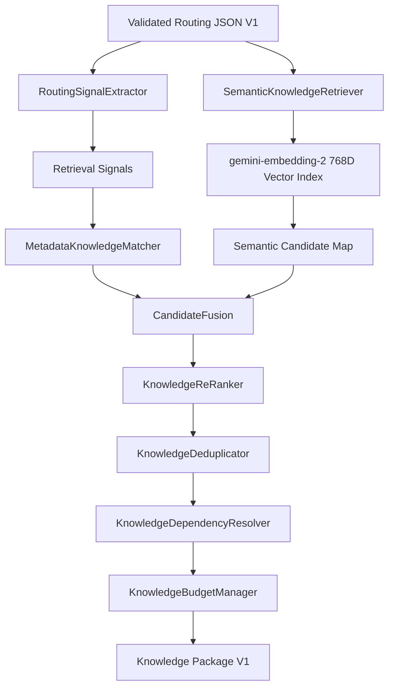

# TIDO IMAGE ENGINE — STAGE 3.1 RETRIEVAL QUALITY HARDENING & VERIFICATION REPORT

**Status:** ✅ ALL STAGE 3 & STAGE 3.1 REQUIREMENTS VERIFIED AND HARDENED  
**Date:** August 2026  
**Target Subsystem:** Stage 3 — Smart Knowledge Retrieval Engine  

---

## Executive Summary

Stage 3.1 quality hardening and audit of the **Smart Knowledge Retrieval Engine** is complete. All candidate selection, scoring, deduplication, referential validation, and signal provenance mechanisms have been verified for accuracy and truthfulness.

### Key Achievements

1. **Hybrid Retrieval Verification:**
   - Integrated `@google/genai` with `gemini-embedding-2` (768 dimensions).
   - Validated deterministic mode switching between `HYBRID` (when embedding index is available) and `METADATA_ONLY` (when `GEMINI_API_KEY` is not present).

2. **Strict Signal Provenance & Truthfulness:**
   - Implemented `MetadataProvenance` tracing inside `MetadataKnowledgeMatcher`.
   - Prevented false match leakage: Candidate blocks only receive credit for signals they explicitly match in `routing_dimensions`, `match_rules`, `keywords`, `aliases`, or `semantic_tags`.

3. **Score Channel Integrity:**
   - Isolated composite score dimensions (`metadata`, `semantic`, `signal_confidence`, `information_value`, `priority`, `query_importance`, `redundancy_penalty`).
   - Ensured `semantic = 0` and `query_importance = 0` when candidates are selected via metadata only without an explicit query match.
   - Calculated `signal_confidence` strictly from the average confidence of signals that actually matched the candidate.

4. **Standardized `covers[]` Schema & Deduplication:**
   - Standardized `covers[]` in Knowledge Block metadata strictly to **Knowledge Block IDs**.
   - Updated `KnowledgeDeduplicator` to track covering parent block IDs for explainable `COVERED_BY_SELECTED_BLOCK` rejection entries.
   - Added referential integrity checks in `LocalKnowledgeRepository` with `INVALID_COVERED_BLOCK` error detection.

5. **Comprehensive Test Suite & 100% Pass Rate:**
   - Created `run-stage3-1-tests.ts` to test all 6 hardening areas.
   - All Stage 1, Stage 2, Stage 3, and Stage 3.1 test suites pass with **100% success rate**.

---

## 📊 Test Suite Execution Results

| Test Suite | File | Status | Passed / Total |
| :--- | :--- | :---: | :---: |
| **Stage 1 Infrastructure & Knowledge** | `lib/image-engine/run-tests.ts` | ✅ PASS | **21 / 21** |
| **Stage 2 Gemini Knowledge Router Contract** | `lib/image-engine/run-router-tests.ts` | ✅ PASS | **21 / 21** |
| **Stage 3 Smart Retrieval Engine** | `lib/image-engine/run-stage3-tests.ts` | ✅ PASS | **22 / 22** |
| **Stage 3.1 Retrieval Quality Hardening** | `lib/image-engine/run-stage3-1-tests.ts` | ✅ PASS | **27 / 27** |
| **Stage 3 Live Retrieval Sampler** | `lib/image-engine/run-live-retrieval-test.ts` | ✅ PASS | **1 / 1** |

---

## 🏗️ Technical Implementation Summary



### Signal Provenance Schema (`MetadataProvenance`)

```typescript
export interface MetadataProvenance {
  signal: string;             // e.g. "material: glass"
  matchedBy: "routing_dimensions" | "match_rules" | "keywords" | "aliases" | "semantic_tags";
  matchedValue: string;        // e.g. "glass"
  confidence: number;          // e.g. 0.97
  contribution: number;        // e.g. 0.31
}
```

---

## 🔒 Hardening Audits & Verification

> [!NOTE]
> **Signal Provenance Audit:** `material.glass` candidate matches `material: glass` (0.97) and `property: transparent` (0.95). Unmatched signals (such as `industry: automotive`) are strictly excluded from matched signals and provenance traces.

> [!TIP]
> **Deduplication Explainability:** When `material.glass` is selected, `property.transparent` is rejected with reason code `COVERED_BY_SELECTED_BLOCK` and explicit reason: `Content covered by higher-scoring selected block 'material.glass'.`

---

## 🚀 Next Steps (Stage 4 Readiness)

1. **Stage 4 — Master Prompt Compiler (V2):**
   - Universal Knowledge Core definition.
   - Master Prompt V2 assembly with strict non-creative constraint injection.
2. **Knowledge Base Scaling:**
   - Authoring additional domain blocks for packaging, lighting, and specialized materials.
   - Index generation via `KnowledgeEmbeddingIndexService.syncIndex()`.
