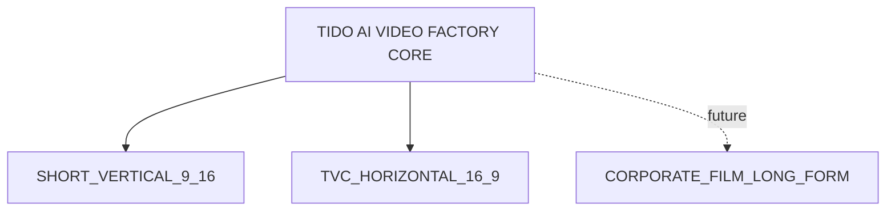

# Master System Specification

## Product vision

TIDO AI Video Factory là hệ thống nội bộ biến brief thành video hoàn chỉnh. User bảo đảm dữ liệu đầu vào; Claude tạo creative; TIDO Production Brain cung cấp kỹ thuật; hệ thống tự sản xuất, QC và hậu kỳ.

## Product structure

## Core System

- Project/versioning
- Brief management
- Claude Creative Engine
- Creative approval
- Production Brain retrieval
- SceneSpecification base
- Production Planner
- Nano Banana 2 pipeline
- Voice Engine
- Music/SFX Engine
- Video Model Router
- Scene Quality Loop
- FFmpeg/Remotion Composer
- Final QC
- Cost Controller
- Audit log
- Analytics

## Locked decisions

1. Stage 1 do user kiểm soát.
2. Stage 2 dùng Claude.
3. Bước 7 là user approval.
4. Nano Banana 2 là image model duy nhất.
5. Voice lấy từ kho công ty.
6. Music được chọn riêng từng project.
7. Production Brain là nguồn kỹ thuật quay dựng.
8. Một scene là một job độc lập.
9. Core dùng chung cho 9:16 và 16:9.
10. V1 dùng nội bộ.
11. Brand graphics dựng deterministic.
12. Cost/quality đo theo usable output.

## MVP profiles

### Short Vertical
- 9:16, 1080 × 1920
- 15/30s
- TikTok/Reels/Shorts
- hook, retention, mobile text, platform safe zones
- Vertical Master + platform variants

### TVC Horizontal
- 16:9, 1920 × 1080
- 15/30s
- TVC ngắn/digital commercial
- wide composition, cinematic continuity, product hero, brand storytelling
- Horizontal Master + delivery variants

## Responsibility

| Layer | Owner |
|---|---|
| Business data | User |
| Creative treatment/script | Claude |
| Creative approval | User |
| Production knowledge | TIDO Production Brain |
| AI images | Nano Banana 2 |
| Voice selection | Voice Engine |
| Music selection | Music Engine |
| Video generation | Video Router |
| Scene QC | Quality Loop |
| Post-production | Remotion + FFmpeg |
| Final approval | User |
