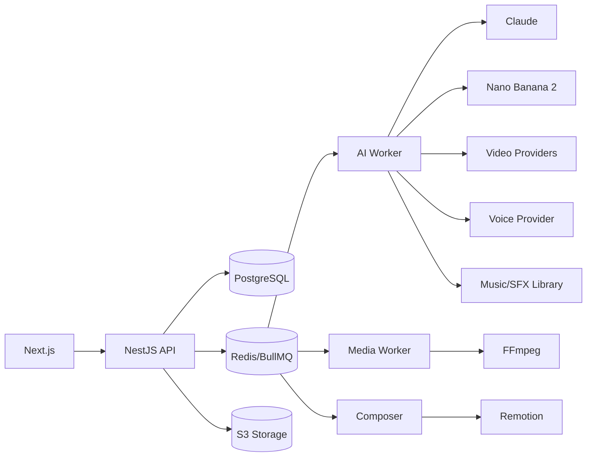

# Core Architecture

## Style

Modular monolith + background workers. Không dùng microservice/Kubernetes trong Version 1.

## Logical architecture

## Source of truth

- PostgreSQL: trạng thái, version, cost, QC.
- Redis: queue/cache/locks.
- S3: binary assets.
- API sở hữu state transition.
- Workers báo kết quả về API.
- Provider URLs chỉ là tạm thời.

## Core modules

Identity, Project, Brief, Creative, Production Brain, Scene, Asset, Provider Registry, Cost Ledger, Composer, QC, Admin/Debug.

## Reliability

- idempotency key;
- transaction/outbox;
- provider job ID lưu ngay sau submit;
- retry/backoff;
- circuit breaker;
- dead-letter;
- reconciliation;
- checksum;
- immutable versions;
- cost reserve;
- cancellation.
