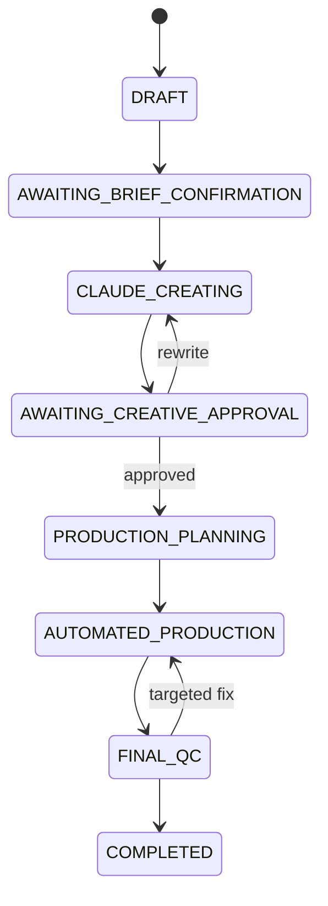

# System Flow — 3 Stages / 12 Steps

## Stage 1 — User Input & Control

1. Create project.
2. Enter brief/assets.
3. User checks and adjusts.
4. Confirm and lock brief.

Stage 1 không dùng AI reasoning. Hệ thống chỉ rule-validation.

## Stage 2 — Claude Creative Planning

5. Create Creative Treatment.
6. Create Script and Audio Direction.
7. User review and approval.
8. Create SceneSpecification từ Approved Script và Technique Cards.

## Stage 3 — Automated Production & Output

9. Production Planning.
10. Nano Banana 2, Voice, Music/SFX và Video Scene pipelines + Quality Loop.
11. Automatic Post-production.
12. Final QC and output variants.

## State machine

## Dependency invalidation

- Brief đổi lớn → invalidate treatment/script/scenes/plan.
- Script wording đổi → invalidate voice/timing liên quan.
- Voice đổi → không invalidate image/video.
- Music đổi → không invalidate image/video.
- Logo/price/CTA đổi → chỉ invalidate composition.
- Scene spec đổi → invalidate scene output và final output phụ thuộc.
