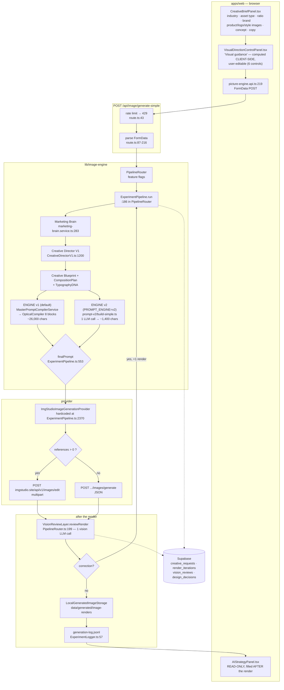

# 01 — System Analysis (Phase 1 Audit)

Read-only audit of the existing render pipeline, in preparation for a migration to a
single provider/model family (GPT-Image-2.5-Sunburst). **No design, no implementation.**

Audit date: 2026-10-05. Branch: `feat/prompt-engine-v2`.
Method: static reading of the repository only. **No image-generation or LLM API was
called.** Where a claim could not be established from the code, it is marked
**UNVERIFIED** rather than guessed.

All paths are relative to the repository root `D:\Tido` unless they begin with
`apps/`, `packages/`, `services/` or `docs/`, which are relative to
`tido-ai-video-factory-claude-code-pack/`.

---

## Table of contents

1. [Architecture map](#1-architecture-map)
2. [Prompt-building layers](#2-prompt-building-layers)
3. [Nano Banana / Gemini coupling inventory](#3-nano-banana--gemini-coupling-inventory)
4. [Reference image handling](#4-reference-image-handling)
5. [Current prompt assembly, per asset type](#5-current-prompt-assembly-per-asset-type)
6. [On-image text](#6-on-image-text)
7. [Aspect ratio and size](#7-aspect-ratio-and-size)
8. [Model registry, pricing, credits](#8-model-registry-pricing-credits)
9. [Reliability](#9-reliability)
10. [Tests](#10-tests)
11. [Migration risks](#11-migration-risks)
12. [Open questions for you](#12-open-questions-for-you)
13. [Nano Banana coupling points](#nano-banana-coupling-points)

---

## 0. The five findings that matter most

Stated up front because they change how the migration must be scoped.

**F1 — The provider abstraction exists and the render path bypasses it.**
`lib/image-engine/service/ImageGenerationService.ts:37` reads `TIDO_IMAGE_PROVIDER`
and returns one of three providers. Nothing on the live render path calls it: its only
importer is `lib/image-engine/service/ImageEditService.ts:4`. The live path instead
constructs ImgStudio directly at
`lib/image-engine/evolution/ExperimentPipeline.ts:2258`,
`:2370`,
`lib/image-engine/service/SimpleImageGenerationOrchestratorService.ts:864` and
`app/api/campaign/render-asset/route.ts:146`.
Consequence: setting `TIDO_IMAGE_PROVIDER=gemini` changes what the UI *reports*
(`app/api/image/provider/route.ts:6`) and does **not** change what renders. A migration
cannot be delivered by "adding a provider" until the hot path goes through one seam.

**F2 — The live form offers an aspect ratio the provider refuses, and defaults to it.**
`apps/web/features/picture-engine/components/brief/CreativeBriefPanel.tsx:89` offers
`["1:1","4:5","9:16","16:9"]` and line `:54` defaults to `"4:5"`. The provider rejects
anything outside `["1:1","9:16","16:9"]`
(`lib/image-engine/config.ts:157`, enforced at
`lib/image-engine/provider/ImgStudioImageGenerationProvider.ts:96-107`, error code
`UNSUPPORTED_ASPECT_RATIO`). The two older UIs use the correct three
(`components/RenderImageComponents.tsx:288`,
`components/SimpleRenderImageComponents.tsx:325`) and are **dead code** — no importer.

**F3 — The image model is reached through a reseller, not the vendor.**
Endpoint `https://imgstudio.site/api/v1/images/{edit,generate}`
(`ImgStudioImageGenerationProvider.ts:57-61`, base URL from `IMGSTUDIO_BASE_URL` at
`:73`), model selected by the opaque string `IMGSTUDIO_PROVIDER_ID`, default
`"flow-nano-banana-2"` (`:75`). The text LLM is likewise reached through a local
OpenAI-compatible gateway, default `http://127.0.0.1:8317/v1`
(`lib/image-engine/llm/llm-provider.service.ts:26`). **No direct Google or OpenAI SDK
call exists on the live path.** Whether this reseller passes `size`, `quality` and
multiple references through to the upstream model is **UNVERIFIED** — see §12.

**F4 — The prompt engine is mid-rewrite; two engines are in the tree.**
`PROMPT_ENGINE=v1|v2`, default v1 (`lib/image-engine/prompt-v2/engine-selector.ts`,
`DEFAULT_PROMPT_ENGINE`). v1 is a deterministic 8-block assembly of ~26,000 characters;
v2 is one LLM call producing ~1,400 characters. v2 is behind the flag and falls back to
v1 on failure. A migration plan has to say which engine it targets.

**F5 — Nothing resizes, crops or upscales after the render.**
`lib/image-engine/delivery/export-presets.ts:38-52` declares crop derivations, but its
only importer is `lib/image-engine/delivery/DeliveryPackageService.ts:4`, which uses it
for file **naming** and a manifest; no `sharp` `extract`/`resize` call exists in
`delivery/` or `finishing/`. The render is stored and served exactly as the provider
returned it.

---

## 1. Architecture map

### 1.1 Stack

| Layer | What is actually there | Evidence |
|---|---|---|
| Frontend + backend | **One Next.js app**, `apps/web`. App Router, `runtime = "nodejs"` | `apps/web/app/api/image/generate-simple/route.ts:13` |
| Separate API service | **Does not exist.** `apps/api` contains 0 TypeScript files | `find apps/api -name "*.ts"` → 0 |
| Queue / workers | **Does not exist** on the render path. Renders are synchronous inside the Next route | `app/api/image/generate-simple/route.ts:26` is the only entry; no BullMQ import on this path |
| DB | Supabase/PostgreSQL, 13 SQL migrations | `packages/infrastructure/migrations/0001…0013` |
| Image storage | **Local filesystem**, not S3 | `lib/image-engine/storage/LocalGeneratedImageStorage.ts:48-50`; dir from `config.ts:130` = `data/generated/image-renders` |
| CI | **None.** No `.github/workflows` | directory absent |
| `packages/picture-engine` | A parallel, **non-functional** engine. `NanoBanana2Adapter` has no `fetch`/SDK call | `packages/picture-engine/src/adapters/nano-banana-2.adapter.ts` (83 lines, no network call) |

`docs/01-core-architecture.md` describes NestJS + Redis/BullMQ + S3 + AI worker. **None
of that is on the render path.** The document describes an intent, not the system.

### 1.2 Entry points

| Kind | Path | Evidence |
|---|---|---|
| UI page | `/render-image` → `PictureEngineContainer` | `apps/web/app/render-image/page.tsx:7` |
| Render API | `POST /api/image/generate-simple` | `apps/web/app/api/image/generate-simple/route.ts:26` |
| Image serving | `GET /api/image/generated/[id]` | `apps/web/app/api/image/generated/[id]/route.ts:38` |
| Provider display | `GET /api/image/provider` | `apps/web/app/api/image/provider/route.ts:5` |
| Campaign render | `POST /api/campaign/render-asset` | `apps/web/app/api/campaign/render-asset/route.ts:146` |

The client posts `multipart/form-data` from
`apps/web/features/picture-engine/services/picture-engine.api.ts:219`, with product
files under `images`, logo under `logoImages`, style reference under
`inspirationImages` (`:167`, `:183`, `:199`).

### 1.3 Diagram



Note the two unusual edges: **"Visual guidance" is computed in the browser, before the
request**, and **AIStrategyPanel is filled after the render** — it is a report, not an
input. §2.4 covers both.

---

## 2. Prompt-building layers

LLM calls on the render path, in order. Every one goes through
`LLMProviderService.generateChatCompletion` → the OpenAI-compatible gateway at
`lib/image-engine/llm/llm-provider.service.ts:26` (`LLM_BASE_URL`, default
`http://127.0.0.1:8317/v1`), model from `LLM_MODEL`, default `"claude-sonnet-4-6"`
(`:28`). The model observed in a real dev-server log was `gemini-3.7-flash-high`, i.e.
the gateway serves several vendors behind one OpenAI-shaped API.

| # | Layer | File | Purpose string | Output |
|---|---|---|---|---|
| 1 | Marketing Brain | `lib/image-engine/llm/marketing-brain.service.ts:283` | `marketing_brain` | business goal → consumer insight → emotional response → creative message chain (`:66`) |
| 2 | Creative Director V1 | `lib/image-engine/evolution/experiment/CreativeDirectorV1.ts:1200` | see file | directions, selection, judgment |
| 3 | Visual DNA (conditional) | `lib/image-engine/evolution/experiment/VisualDNAAnalyzer.ts:330` | — | reads the reference image |
| 4 | Inspiration style (conditional) | `lib/image-engine/service/InspirationStyleIntelligenceService.ts:149` | — | style manifest from the style-reference image |
| 5 | Creative interpretation | `lib/image-engine/service/CreativeInterpretationService.ts:328` | — | — |
| 6 | **Engine v2 director** (flag only) | `lib/image-engine/evolution/ExperimentPipeline.ts:1372` | `prompt_v2_meta` / `prompt_v2_repair` | the whole image prompt |
| 7 | Vision review (after render) | `lib/image-engine/evolution/experiment/VisionAnalyzerService.ts:92` | `vision_render_critic` | `visible_text`, typography/layout/product problems, improvement actions |
| — | Concept professionalizer (user-triggered button) | `lib/image-engine/service/ConceptProfessionalizerService.ts:269` | — | rewritten concept |

A measured v1 render made **2 model calls** (`CREATIVE_DIRECTOR`, `VISION_REVIEW`) plus
1 image render; a measured v2 render made 3 (v2 adds its call, it does not remove any) —
`isV2()` is consumed in exactly one place,
`lib/image-engine/evolution/ExperimentPipeline.ts:1261`, which only decides whether to
*build* the v2 prompt. Nothing upstream is skipped.

### 2.1 Engine v1 — the deterministic assembly (default)

`MasterPromptCompilerService` composes named sections; `OpticalCompiler` routes those
sections into eight blocks and emits the final script.

| Block | Content | Evidence |
|---|---|---|
| 1 OUTPUT CONTRACT | authority rule, channel, role, anti-verdict paragraph | `lib/image-engine/evolution/experiment/OpticalCompiler.ts` (`BLOCK_ORDER`, `AUTHORITY_RULE`, `OUTPUT_RULE`) |
| 2 IDENTITY LOCK | reference roles, product manifest, reference semantics | `lib/image-engine/compiler/MasterPromptCompilerService.ts:349-430` |
| 3 SUBJECT & STAGING | `THE IDEA`, campaign strategy, scene, layout plan, audience | `.../IdeaLayer.ts:190` emits `THE IDEA — …` |
| 4 LIGHT | sources, Kelvin, key:fill ratio, shadow, haze % | `.../CinematographyLayer.ts` |
| 5 LENS | focal length, aperture, camera angle, frame share | `.../CinematographyLayer.ts` |
| 6 ENVIRONMENT | surface luminance %, backdrop evenness, props, planes | `.../CinematographyLayer.ts` |
| 7 GRADE & MATERIAL | film stock, black level `n/255`, rolloff stops, grain %, vignette % | `.../FinishLayer.ts` |
| 8 TYPOGRAPHY | T1 ledgers, T2 material, T3 optics, T4 forbidden | `.../TextLedgerSystem.ts`, `.../OpticalCompiler.ts` (`buildTypographyBlock`) |

Section→block routing: `OpticalCompiler.ts:798` (`[/^ASSET CONTEXT/i, 1]`) and the
`SECTION_ROUTE` table around it.

### 2.2 Engine v2 — one LLM call (flag)

Four text files on disk, loaded at request time:
`apps/web/lib/image-engine/prompt-v2/templates/system.v1.md` (standing instructions, no
slots), `request.v1.md` (this job's brief, all slots),
`playbooks/<asset>.v1.txt`, `gold-examples/<asset>.md`. Loader:
`lib/image-engine/prompt-v2/templates.ts` (`loadTemplates`). Brief assembly:
`lib/image-engine/prompt-v2/brief-compiler.ts` (`compileBrief`). Reply parsing: five
tags in `lib/image-engine/prompt-v2/tags.ts` (`TAGS`). Validation: three checks in
`lib/image-engine/prompt-v2/checks.ts` (`checkPrompt`). Orchestration, one call plus at
most one repair: `lib/image-engine/prompt-v2/build-simple.ts` (`buildSimplePrompt`).

### 2.3 Where the two engines meet

```ts
// lib/image-engine/evolution/ExperimentPipeline.ts:553
const finalPrompt = v2?.ok && v2.prompt ? v2.prompt : optical ? optical.prompt : ...
```

This is the single line at which the prompt is decided, and the only place a migration
needs to intercept to change what is sent.

### 2.4 "Visual guidance" — where it is produced and how it flows

This is the part most likely to be misread, so it is spelled out.

**It is NOT an LLM call.** `components/VisualDirectionControlPanel.tsx:24-35` states the
plan is computed **in the browser** so that client and server derive the same plan from
the same inputs without a round trip. The six controls are
`camera, lens, lighting, composition, typography, color_mood`
(`lib/image-engine/director/visual-controls.types.ts:39-46`); each option carries a
user-facing `label` and a professional `instruction` (`:74-82`).

Flow of the possibly-edited value:

1. user edits → `VisualDirectionControlPanel` `onChange`
   (`components/VisualDirectionControlPanel.tsx:49`)
2. held in the brief, mounted at
   `features/picture-engine/components/brief/CreativeBriefPanel.tsx:451`
3. serialised into FormData as `creativeDirection`
   (`features/picture-engine/services/picture-engine.api.ts:162`)
4. parsed server-side (`app/api/image/generate-simple/route.ts:118`)
5. resolved against evidence precedence by
   `VisualDirectionResolver.resolve` (`lib/image-engine/director/CreativeDirectorPipeline.ts:68`)
   into `ResolvedVisualControls` (`visual-controls.types.ts:369-375`, with
   `source: "user_selected" | "concept_detected" | "reference_image" | …` at `:48-57`)
6. **engine v1** consumes it through the director pipeline; **engine v2** consumes
   `request.creativeDirection.visual_controls` directly at
   `lib/image-engine/evolution/ExperimentPipeline.ts:1330`, rendering only
   `user_selected` choices as a binding CLIENT PREFERENCES block
   (`lib/image-engine/prompt-v2/brief-compiler.ts`, `clientPreferences`).

`AIStrategyPanel` is a different thing with a confusingly similar name: it is populated
**after** the response, from `data.strategy`
(`features/picture-engine/services/picture-engine.api.ts:375-383`), and has no
`onChange` — it is read-only (`features/picture-engine/components/strategy/AIStrategyPanel.tsx:16-33`).

---

## 3. Nano Banana / Gemini coupling inventory

Raw grep count for `gemini|nano.banana|generativelanguage|@google/genai` across
`apps packages services contracts schemas`, excluding `node_modules`, test and benchmark
runners and `docs/`: **2,168 matches**. Most are prose in comments and knowledge cards.
What follows is the set that would actually have to change.

### 3.1 Live path

| # | Site | What it does | Difficulty | Replacement |
|---|---|---|---|---|
| C1 | `lib/image-engine/provider/ImgStudioImageGenerationProvider.ts:57-61` | `selectEndpoint` → `/api/v1/images/edit` vs `/generate` | **medium** | a new provider class choosing the OpenAI images edit/generate route |
| C2 | `…ImgStudioImageGenerationProvider.ts:73-75` | base URL, API key, `IMGSTUDIO_PROVIDER_ID` default `"flow-nano-banana-2"` | **easy** | registry entry per §8 |
| C3 | `…ImgStudioImageGenerationProvider.ts:354-367` | multipart fields `prompt, provider_id, aspect_ratio, resolution, quality` | **hard** | the target API's own parameter names; `aspect_ratio` in particular has no OpenAI equivalent — it is `size` |
| C4 | `…ImgStudioImageGenerationProvider.ts:383` | `formData.append("images", fileObj, filename)` — all references under one repeated key, **no role metadata on the wire** | **hard** | the target API's reference mechanism; roles currently survive only inside the prompt text |
| C5 | `…ImgStudioImageGenerationProvider.ts:388-397` (JSON branch) | text-only body with the same five fields | **medium** | as C3 |
| C6 | `lib/image-engine/evolution/ExperimentPipeline.ts:2258`, `:2370` | **hardcoded** `new ImgStudioImageGenerationProvider()` | **medium** | inject through one seam; see F1 |
| C7 | `lib/image-engine/service/SimpleImageGenerationOrchestratorService.ts:864` | same hardcode | **medium** | as C6 |
| C8 | `app/api/campaign/render-asset/route.ts:146` | same hardcode | **easy** | as C6 |
| C9 | `lib/image-engine/service/ImageGenerationService.ts:37-58` | the real provider switch — **unused by the render path** | **easy** | becomes the single seam |
| C10 | `app/api/image/provider/route.ts:6-40` | reports provider/model to the UI from env; three branches hardcode display names `"Flow · Nano Banana 2"`, `"Nano Banana 2"` | **easy** | read from the registry |
| C11 | `lib/image-engine/config.ts:127-129` | `TIDO_IMAGE_MODEL` default `"gemini-3.1-flash-image"`, `TIDO_IMAGE_OUTPUT_SIZE` `"2K"`, `TIDO_IMAGE_OUTPUT_MIME` `"image/png"` | **easy** | registry |
| C12 | `lib/image-engine/config.ts:156-157` | `SUPPORTED_ASPECT_RATIOS` / `IMGSTUDIO_SUPPORTED_ASPECT_RATIOS` = `["1:1","9:16","16:9"]` | **medium** | per-model size table; OpenAI expresses this as pixel sizes |
| C13 | `lib/image-engine/config.ts:172-175` | `IMGSTUDIO_MAX_REFERENCE_IMAGES` default **3** | **easy** | per-model limit in the registry |
| C14 | `lib/image-engine/config.ts:131-132` | `GENERATION_TIMEOUT_MS = 160000`, `SERVER_ROUTE_TIMEOUT_MS = 180000` | **medium** | see §9 — these assume a fast synchronous render |
| C15 | `lib/image-engine/config.ts:145` | `CLIENT_TIMEOUT_MS = 250000` | **medium** | as C14 |
| C16 | `components/RenderImageComponents.tsx:1031-1049`, `:1241` | literal `"flow-nano-banana-2"` / `"Flow · Nano Banana 2"` fallbacks in the UI | **easy** | **dead code** — no importer |

### 3.2 Direct Gemini SDK — present but off the live path

| # | Site | What it does | Difficulty | Replacement |
|---|---|---|---|---|
| C17 | `lib/image-engine/provider/GeminiImageGenerationProvider.ts:1` | `import { GoogleGenAI } from "@google/genai"` | **easy** (delete or keep as dead) | the OpenAI images client |
| C18 | `…GeminiImageGenerationProvider.ts:41` | `GEMINI_API_KEY` | easy | — |
| C19 | `…GeminiImageGenerationProvider.ts:75` | `inlineData` for references | easy | OpenAI multipart file parts |
| C20 | `…GeminiImageGenerationProvider.ts:122` | model default `"gemini-3.1-flash-image"` | easy | — |
| C21 | `…GeminiImageGenerationProvider.ts:127-136` | `ai.models.generateContent({ config: { responseModalities: ["IMAGE"], imageConfig: { aspectRatio, size } } })` — the single most Gemini-shaped call in the repo | easy (unused) | `size` + `quality` on the OpenAI call |
| C22 | `…GeminiImageGenerationProvider.ts:150-156` | parses `response.candidates[0].content.parts[].inlineData.data` | easy (unused) | `data[0].b64_json` |
| C23 | `…GeminiImageGenerationProvider.ts:249-350` | dev SVG/photorealistic fallbacks, with `4:5` and `3:4` branches that the live config no longer allows | easy | delete |

`responseModalities`, `imageConfig`, `inlineData`, `candidates` appear **only** in
`GeminiImageGenerationProvider.ts`. **Not found anywhere in the repository on any path:**
`thinking`, `grounding`, `safetySettings`, `generativelanguage` as a URL.

### 3.3 Other providers and stubs

| # | Site | Note |
|---|---|---|
| C24 | `lib/image-engine/provider/CloudflareImageGenerationProvider.ts:85-86` | a third provider; resizes every reference to 500×500 `inside` |
| C25 | `packages/picture-engine/src/adapters/nano-banana-2.adapter.ts:17-18` | `provider_name = "nano_banana_2"`, `model_name = "flow-nano-banana-2"` — **no network call in the file**; a stub |
| C26 | `lib/image-engine/config.ts:77`, `:85` | `GEMINI_MODEL` default `"gemini-3.6-flash"`, `EMBEDDING_MODEL "gemini-embedding-2"` — text/embedding, not image |
| C27 | `CLAUDE.md` rule 5 | "Không thêm image provider ngoài Nano Banana 2" — a **project rule that forbids this migration**; must be amended first |

---

## 4. Reference image handling

### 4.1 Transport in

Three distinct FormData keys, deliberately separated so the backend cannot mistake a
style reference for a product:

| Role | Key | Evidence |
|---|---|---|
| product | `images` | `features/picture-engine/services/picture-engine.api.ts:167` |
| logo | `logoImages` | `:183` |
| style / inspiration | `inspirationImages` | `:199`, with the comment at `:193-197` explaining why it may never be appended to `images` |

Server-side parse: `app/api/image/generate-simple/route.ts:134-138`.

### 4.2 Roles

`ProviderReferenceImage.role` is typed
`"PRODUCT" | "LOGO" | "SUPPORT_REFERENCE" | "INSPIRATION_REFERENCE" | "AMBIGUOUS" | "UNKNOWN"`
(`lib/image-engine/provider/ImageGenerationProvider.ts:6`), and each reference carries a
`reference_id` such as `REF_01` (`:4`).

**Roles are labelled in the prompt text, not in the request.** The prompt emits
`ATTACHED REFERENCE ROLES (ORDER MATCHES MULTIPART IMAGES)` with `Image 1 (REF_01):
PRODUCT_01 identity reference` — assembled at
`lib/image-engine/compiler/MasterPromptCompilerService.ts:349-430`. On the wire every
file is appended under the same repeated key `images`
(`ImgStudioImageGenerationProvider.ts:383`), so **the binding between "photo 1" in the
prose and the first multipart part is positional only**. That is the single most
fragile assumption in the current design, and §12 asks about it.

Ordering is preserved by array order: the provider iterates `realReferences` in index
order (`:366`) and the prompt numbers from the same array.

### 4.3 Normalisation, limits

| Concern | Behaviour | Evidence |
|---|---|---|
| count limit | 3 per edit request, declared not discovered; the provider answers a 4th with HTTP 400 | `config.ts:160-175`; enforced `ImgStudioImageGenerationProvider.ts:135-175` |
| over-limit behaviour | `ReferencePackingService` composites several products into one grid image | `lib/image-engine/provider/reference-packing/ReferencePackingService.ts:1-2` (uses `sharp` `OverlayOptions`) |
| byte budget | an `UPLOAD_GUARD` normalises and refuses when the total exceeds a budget | `ImgStudioImageGenerationProvider.ts:255-262` |
| metadata read | `sharp(rawBuf).metadata()` | `:283` |
| default mime / filename | `image/png`, `REF_nn.png` | `:294`, `:298` |
| style reference withheld | when a style manifest was extracted, the inspiration image is **not** attached, to stop the model blending two products | `config.ts:144` (`WITHHOLD_INSPIRATION_IMAGE_FROM_PROVIDER`, default on) |
| max product references | 10 (before packing) | `config.ts:146` |

### 4.4 Product appearance lock

Enforced **only as prompt text** — there is no API-level lock:

- `[REFERENCE IDENTITY LOCK]`, `[REF CONTROL] Prio/Lock/Allow/Forbid`,
  `PRODUCT PLANNING MANIFEST` — `MasterPromptCompilerService.ts:349-430`
- `REFERENCE SEMANTICS` with Protected / Re-synthesized lists —
  same file, emitted into Block 2
- v2 equivalent: the PRODUCT FIDELITY paragraph in
  `lib/image-engine/prompt-v2/templates/system.v1.md` and
  `templates/request.v1.md`
- post-render: `lib/image-engine/prompt-v2/label-check.ts`, gated by `V2_LABEL_CHECK`,
  **default off** (`prompt-v2/engine-selector.ts`, `labelCheckEnabled`)

Measured failure of this approach: a live v2 render returned the label as
`"NADAGASCAR"`, `"CAPSOLE"`, `"MAOAGASCAR"` for MADAGASCAR / CAPSULE — recorded in
`CHANGELOG_V2.md` §10.

---

## 5. Current prompt assembly, per asset type

### 5.1 The five types

| UI id | Label | Evidence |
|---|---|---|
| `poster` | Poster | `features/picture-engine/components/brief/AssetTypeSelector.tsx:16-17` |
| `social_ad` | Social Ad | `:22-23` |
| `product_hero` | Product Hero | `:28-29` |
| `banner` | Banner Website | `:34-35` |
| `ugc_thumbnail` | Thumbnail / UGC | `:40-41` |

**The engine does not agree with itself about how many types there are.**

| Layer | Types it knows | Evidence |
|---|---|---|
| `MasterPromptCompilerService` | 5 — maps `ugc_thumbnail` to `specialist.ugc_thumbnail_foundation` | `lib/image-engine/compiler/MasterPromptCompilerService.ts:111` |
| `CreativeFormatPlanner` | 5 — "banner, social ad, thumbnail and product hero" | `lib/image-engine/director/CreativeFormatPlanner.ts:10` |
| `AssetProfile` (experiment layer) | **4** — `poster \| banner \| social \| hero`; `ugc` falls through to `poster` | `lib/image-engine/evolution/experiment/AssetProfile.ts:37`, `:96-101` |
| prompt-v2 playbooks | 5 — including `ugc` | `lib/image-engine/prompt-v2/templates.ts` (`PLAYBOOK_NAMES`) |

So on the **default v1 path**, a Thumbnail/UGC job receives poster numbers from
`AssetProfile` while receiving UGC knowledge from the compiler. Unverified whether this
is visible in output; it is certainly inconsistent.

### 5.2 Fragment order (engine v1, all asset types)

The order is fixed by `BLOCK_ORDER` in `OpticalCompiler.ts`; the asset type changes
*content inside* blocks 1 and 3, not the order:

1. Block 1 — `AUTHORITY`, `CHANNEL — a <asset>` with its attention economics,
   `ROLE`, the anti-verdict paragraph, `COMMERCIAL FRAMING`,
   `ASSET CONTEXT — <TYPE>` (`MasterPromptCompilerService.ts:671`),
   `OUTPUT CONTEXT`, `CREATIVE & RENDER CONSTRAINTS`
2. Block 2 — identity lock (§4.4)
3. Block 3 — `THE IDEA`, `CREATIVE INTENT`, `CAMPAIGN STRATEGY`, `THE SCENE`,
   `VISUAL TRANSLATION`, `COMMERCIAL LAYOUT PLAN` with `RESERVED ZONES`,
   knowledge cards, `AUDIENCE`, `THE FRAME, AS DECIDED`
4. Blocks 4–7 — light, lens, environment, grade (numeric; see below)
5. Block 8 — typography ledgers

Per-asset numbers come from `AssetProfile.PROFILES`
(`AssetProfile.ts:58-92`): minimum cap height as a percentage of frame height, and the
number of copy strings. The file states a banner's floor is nearly double a poster's
because a banner is delivered at a few hundred pixels.

### 5.3 Gemini-specific style and workarounds

Every item below is verifiable in a real captured prompt (a full 26,581-character
example is reproduced in a dev-server log quoted in this session; the stored artefacts
are `data/evolution/generation-log.jsonl` and the per-render `prompt.md` written by
`LocalGeneratedImageStorage.ts:50`).

| Trait | Why it is provider-shaped | Evidence |
|---|---|---|
| **~26,000 characters of prose** | tuned against a model with a very large prompt budget. Hard ceiling `PROMPT_HARD_MAXIMUM_CHARS` default 32,000 | `apps/web/.env.example:19`; budget logic in `lib/image-engine/compiler/ProviderPromptOptimizer.ts` |
| **Aspect ratio stuffed into the text** | the prompt ends with `Square 1:1 frame.` *and* the ratio is a separate multipart field. v2 enforces it as a check | `lib/image-engine/prompt-v2/checks.ts` (`RATIO_SENTENCE`, the `ratio` check) |
| **Negation blocks** | `T4 · FORBIDDEN` and the long `NEGATIVE CONSTRAINTS` list, i.e. steering by prohibition | `lib/image-engine/evolution/experiment/TextLedgerSystem.ts:592`; `lib/image-engine/compiler/ExactCopyIntegrityValidator.ts:108` |
| **Physical parameters as numbers** | `3200K`, `f/5.6`, `100mm`, `key to fill 6:1`, `12/255`, `3 stops`, `grain 0.15%`, `haze 24%`. Whether any of it changes the image is **a strong hypothesis, not proven** — the controlled L2-vs-L3 test was never run | `CHANGELOG_V2.md` §5 states this explicitly; emitted by `CinematographyLayer.ts`, `FinishLayer.ts` |
| **Quality trigger words** | the prompt contains an entire paragraph *forbidding* verdict words (premium/luxury/cinematic) because they were producing generic gloss | `OpticalCompiler.ts` (`OUTPUT_RULE`); v2 enforces the ban in `checks.ts` (`FORBIDDEN_WORDS`) |
| **Channel-2 leftover** | `Reserve clean, uncluttered negative space for post-production typography layout` still ships, although compositing text with code was cancelled — it contradicts Block 8 | `lib/image-engine/service/CreativeConstraintService.ts:32` |
| **Unfilled placeholder** | `BUSINESS GOAL: in beauty_skincare` reached a real render: a sentence whose subject was an empty variable | assembly at `lib/image-engine/compiler/MasterPromptCompilerService.ts:613-620` |
| **Ledger tokens leaking** | `[B1]`, `[H1]`, `[S1]` appear outside Block 8, e.g. `BRAND NAME: [B1]` | observed in a captured prompt; tokens defined in `TextLedgerSystem.ts` |

Any migration that keeps this prompt verbatim is migrating the workarounds too.

---

## 6. On-image text

### 6.1 Entry

Two inputs merge into one requirement:
`resolveTextRequirement({ contentMessage, copyItems })`
(`lib/image-engine/compiler/ExactCopyIntegrityValidator.ts:76-79`) →
`TextRequirement { mode, lines: string[] }` (`:66-70`). Roles on `copyItems` are
**collapsed**: `lines` is `string[]`.

Transport: `contentMessage` at
`features/picture-engine/services/picture-engine.api.ts:148`, `copyItems` at `:159`;
parsed at `app/api/image/generate-simple/route.ts:90`, `:105`.

### 6.2 Verbatim, and Vietnamese diacritics

Handled with unusual care, and the care is the evidence that it was a problem:

- Block 8 T1 lists each string with a grapheme count and **names every required
  diacritic**: `ề = e + circumflex + grave · ị = i + dot below`, generated by
  `lib/image-engine/evolution/experiment/TextLedgerSystem.ts` (`graphemeCount`,
  `accentedChars`, `markCounts`)
- T4 forbids transliterated, unaccented or translated forms —
  `TextLedgerSystem.ts:592` and neighbours
- NFC normalisation on the v2 path:
  `lib/image-engine/prompt-v2/brief-compiler.ts` (`nfc`),
  `lib/image-engine/prompt-v2/checks.ts` (`canonical`)
- v2 language detection requires Vietnamese-only evidence (the seven extra letters, or
  hook-above / dot-below), explicitly so French `Crème` is not mislabelled —
  `brief-compiler.ts` (`textLanguage`)

### 6.3 Post-render verification

**There is no OCR.** Verification is a vision-LLM call that is asked to transcribe what
it can read:

- the request tells the model the exact expected strings and asks for a character-by-
  character comparison — `lib/image-engine/evolution/experiment/VisionAnalyzerService.ts:92`
  and the instruction block around `:280`
- the comparison itself is deterministic code over the model's reported `visible_text`:
  `checkRenderedText(visible, req)` at
  `lib/image-engine/compiler/ExactCopyIntegrityValidator.ts:234`
- the pre-render counterpart validates the compiled prompt, not the image:
  `ExactCopyIntegrityValidator.validate` called at
  `lib/image-engine/compiler/MasterPromptCompilerService.ts:1134`

Two measured defects in this chain, both recorded in `CHANGELOG_V2.md` §10:

1. the gate compared the render against the **shortened** copy list and reported
   `compliant: true` when the engine had silently cut sentences — fixed by
   `lib/image-engine/evolution/VisionReviewLayer.ts` now substituting `copy_final` only
   when the policy was `adapt`
2. when the vision call fails (HTTP 500 observed), `findings: 0` yields
   `scores: 10/10/10/10/10` and `shippable: true` — absence of evidence scored as
   evidence of absence. `lib/image-engine/evolution/experiment/TypographyCritique.ts:302-319`
   (`worst()` returns 10 for an area with no findings). **Still open.**

---

## 7. Aspect ratio and size

### 7.1 Mapping today

| Stage | Value | Evidence |
|---|---|---|
| UI (live) | `["1:1","4:5","9:16","16:9"]`, default `"4:5"` | `features/.../CreativeBriefPanel.tsx:89`, `:54` |
| UI (dead) | `["1:1","9:16","16:9"]` | `components/RenderImageComponents.tsx:288` |
| config | `SUPPORTED_ASPECT_RATIOS = ["1:1","9:16","16:9"]`; 4:5, 5:4, 3:4, 4:3 **deliberately removed** | `lib/image-engine/config.ts:148-157` |
| provider gate | rejects anything else with `UNSUPPORTED_ASPECT_RATIO` | `ImgStudioImageGenerationProvider.ts:96-107` |
| on the wire | multipart field `aspect_ratio` (string, e.g. `"1:1"`) | `:359` |
| also in the prompt | trailing sentence `Square 1:1 frame.` | §5.3 |
| size | multipart `resolution` = `TIDO_IMAGE_OUTPUT_RESOLUTION` or `input.imageSize` or `"1K"`; `quality` = `TIDO_IMAGE_OUTPUT_QUALITY` or `"standard"` | `:76-77` |
| config default size | `TIDO_IMAGE_OUTPUT_SIZE = "2K"` — **a different default from the provider's `"1K"` fallback** | `config.ts:128` vs provider `:76` |

The ratio therefore travels **twice** (field and prose) and the output size travels as an
opaque string whose accepted values are **UNVERIFIED**.

### 7.2 After the render

Nothing happens. No upscale, no crop, no resize — see F5. `EXPORT_PRESETS` with
`derivation: "crop"` (`lib/image-engine/delivery/export-presets.ts:38-52`) is consumed
only for naming in `DeliveryPackageService.ts:4`; no `sharp` `extract`/`resize` exists in
`delivery/` or `finishing/`.

---

## 8. Model registry, pricing, credits

### 8.1 There is no registry, and no price list

Searched `app`, `lib`, `components`, `features` for credit/price/VND: no model table, no
per-model price, no credit ledger. The model is a single env string
(`IMGSTUDIO_PROVIDER_ID`, `ImgStudioImageGenerationProvider.ts:75`).

The UI does **not** let the user choose a model or see a price: it fetches
`/api/image/provider` once (`components/RenderImageComponents.tsx:367`) and displays the
result read-only (`:1031-1049`) — and that component is dead code anyway.

**The "model list with per-model prices" described in the brief does not exist in this
repository.** `Bảng giá API đề xuất.docx` at the repository root is a document, not code.

### 8.2 Money

Cost is **reported by the reseller after the fact**, never computed or reserved locally:

```
remoteDetails: { cost_vnd, balance_vnd, provider_name, model, url }
```
`lib/image-engine/provider/ImageGenerationProvider.ts:42-50`; populated by the ImgStudio
adapter and logged at `lib/image-engine/evolution/ExperimentPipeline.ts:742`. A real
render reported `cost_vnd: 100, balance_vnd: 4500`.

| Question | Answer | Evidence |
|---|---|---|
| when are credits deducted | **upstream, by ImgStudio.** This app has no credit entity | no credit table in `packages/infrastructure/migrations/*` |
| refund on failure | relies on the reseller. The adapter encodes the knowledge that a definitively-rejected attempt **is refunded**, and that its idempotency key may not be reused | `ImgStudioImageGenerationProvider.ts:112-116`, `:445-446` |
| cost ledger | **none.** `docs/07-qc-cost-reliability.md` specifies one; no table exists | — |

### 8.3 What a registry would have to hold

Already scattered as constants, each a future registry row: model id (`config.ts:127`),
supported ratios (`:157`), max references (`:172`), output size (`:128`), mime (`:129`),
timeouts (`:131-132`, `:145`), prompt char ceiling (`.env.example:19`).

---

## 9. Reliability

| Concern | Current state | Evidence |
|---|---|---|
| job model | **none.** Synchronous HTTP request; the browser holds the connection for the whole render | `app/api/image/generate-simple/route.ts:26`; a measured route total of 124,877 ms |
| job states | no state machine on this path; a `status` string is written to the log line | `data/evolution/generation-log.jsonl` fields `status`, `success` |
| queue | not on the render path | no BullMQ import under `app/api/image/` |
| provider timeout | 160,000 ms, `IMG_PROVIDER_TIMEOUT_MS` | `ImgStudioImageGenerationProvider.ts:81` |
| route timeout | 180,000 ms | `config.ts:132` |
| client timeout | 250,000 ms, `NEXT_PUBLIC_CLIENT_TIMEOUT_MS` | `config.ts:145` |
| retries | 3 attempts total (`maxRetries = 2`), backoff 1 s / 2 s, 2 s × attempt for rate limits | `ImgStudioImageGenerationProvider.ts:313`, `:529-530` |
| error classification | a dedicated classifier decides retryability | `lib/image-engine/provider/ProviderErrorClassifier.ts` |
| 413 handling | changes the request, then retries exactly once | `ImgStudioImageGenerationProvider.ts:466` |
| idempotency | key per request; **a new key per retry** after a definitive rejection, because reuse earns HTTP 409 | `:108-116`, `:336` |
| rate limiting | yes, returns 429 with `Retry-After` | `app/api/image/generate-simple/route.ts:43` |
| storage | local disk: image + `metadata.json` + `prompt.md` per render | `lib/image-engine/storage/LocalGeneratedImageStorage.ts:48-50` |
| DB | `creative_requests`, `creative_intelligence`, `creative_blueprints`, `design_decisions`, `render_iterations`, `vision_reviews` | `packages/infrastructure/migrations/0003_creative_intelligence.sql:40,84,116,144,183,212` |
| logging | JSONL per render | `lib/image-engine/evolution/ExperimentLogger.ts:57` |
| error tracking | **none found** (no Sentry or equivalent) | — |
| correction loop | runs after the vision review, needs a time budget | `lib/image-engine/evolution/PipelineRouter.ts:199-204` |

### 9.1 Everything that assumes a fast synchronous render

This is the section the migration should read first, because the target model is slower
at high quality.

1. **The whole render is one HTTP request.** 124 s was measured end to end; the client
   waits. A slower model pushes straight into the 180 s route ceiling (`config.ts:132`)
   and then the 250 s client ceiling (`:145`).
2. **The correction loop is already dead because of the clock.** A measured render:
   `remaining_ms: 58279, needed_ms: 141973, haveTime: false,
   skip_reason: "insufficient_time_budget"`. It had found two correct, executable fixes
   and discarded both. With a slower model this never fires again.
3. **No queue, no job id to poll.** There is nothing to resume: a disconnect loses the
   render even though the reseller has been paid.
4. **Retries multiply the wall clock**, not just the cost: 3 attempts × a slow model
   against a fixed 160 s per-attempt timeout.
5. **No persisted provider job id** on this path, so the reconciliation that
   `docs/07-qc-cost-reliability.md` specifies cannot be implemented without a schema
   change.

---

## 10. Tests

### 10.1 What exists

A bespoke harness, not Jest or Vitest: ~150 `run-*.ts` and `test-*.ts` files under
`lib/image-engine/`, aggregated by `lib/image-engine/run-all-tests.ts` (`SUITES` at
`:16`, `--keep-going` at `:91`). `npm test` → `npx tsx lib/image-engine/run-all-tests.ts`
(`apps/web/package.json`).

Measured on 2026-10-05: **54 suites, 1693 passed, 6 failed.** The 6 failures are
pre-existing and attributed in `CHANGELOG_V2.md` §3 (four suites:
`run-visual-controls-integration-tests`, `run-content-message-tests`,
`run-vision-loop-tests`, `run-creative-director-tests`); most are grep-over-source
assertions that broke when a line was legitimately reworded.

Typecheck: `npx tsc --noEmit` → 4 errors, **all in untracked `scratch/`**.

### 10.2 Snapshot tests for a prompt builder — already there

This is the good news for the migration: the pattern exists and works.

| Asset | Path |
|---|---|
| golden prompts, byte for byte | `lib/image-engine/prompt-v2/golden/v1/centella_two_bottles_326_chars.txt`, `hero_no_copy.txt`, `poster_one_product_short_copy.txt` |
| golden runner, with `--update` | `lib/image-engine/run-prompt-engine-golden-tests.ts` |
| shared fixtures | `lib/image-engine/prompt-v2/golden-fixtures.ts` (`GOLDEN_FIXTURES`, `CENTELLA_COPY`) |
| 23-brief comparison set | `lib/image-engine/prompt-v2/eval/cases.ts` |
| free mock eval | `lib/image-engine/run-prompt-v2-eval.ts` |
| paid eval, refuses without an explicit flag | `lib/image-engine/run-prompt-v2-eval-live.ts` (requires `--yes-i-approve-spending`) |
| the v2 engine's own suite | `lib/image-engine/run-prompt-v2-simple-tests.ts` — 103 tests, every model reply a hand-written fixture |

A new deterministic builder for the target model should be pinned the same way: golden
files per asset type × ratio, updated only deliberately.

### 10.3 Gaps

- no test exercises the **provider adapter against a recorded HTTP response** — there is
  no cassette/VCR layer, so request shape is only asserted indirectly
- no test asserts the UI's ratio list matches `SUPPORTED_ASPECT_RATIOS` (F2 would have
  been caught)
- no test asserts the render path uses `resolveActiveProvider` (F1 would have been caught)
- no CI, so none of the above runs on its own

---

## 11. Migration risks

| # | Risk | Severity | Why |
|---|---|---|---|
| R1 | **Provider choice is hardcoded in four places on the hot path** | high | F1. Any "add a provider" plan silently does nothing until this is one seam |
| R2 | **Reference roles are positional only** | high | §4.2. The prompt says "photo 1 is the product"; the request says `images, images, images`. If the target API reorders, dedupes or re-encodes parts, every identity lock silently points at the wrong image |
| R3 | **`aspect_ratio` has no equivalent in the OpenAI image API** | high | §7. The target expresses shape as pixel `size`. The ratio currently travels twice, and both paths need replacing — plus the prompt text that states it |
| R4 | **Prompt logic and provider logic are tangled** | high | the 26,000-character prompt is tuned to one model's budget and its negation-steering; `ProviderPromptOptimizer` exists specifically to squeeze prompts under a provider ceiling |
| R5 | **No queue; a slower model breaks three timeouts** | high | §9.1. This is a schema and architecture change, not a config change |
| R6 | **`CLAUDE.md` rule 5 forbids the migration** | medium | `CLAUDE.md` "Không thêm image provider ngoài Nano Banana 2". Amend the constitution first, or every later change violates it |
| R7 | **The live form offers 4:5 and defaults to it** | medium | F2. Whatever the target supports, this has to be reconciled, and a test should pin it |
| R8 | **Two prompt engines in flight** | medium | F4. Migrating both doubles the work; migrating one leaves a fallback that speaks a different dialect |
| R9 | **No cost ledger, no credit entity** | medium | §8.2. Money is whatever the reseller reports. Moving to a different biller means building this |
| R10 | **The quality loop reports 10/10 when it cannot see** | medium | §6.3 item 2. A migration will produce new defect classes, and the instrument that should catch them currently lies on failure |
| R11 | **Physical parameters may be doing nothing** | medium | §5.3. Carrying ~6 numeric blocks to a new model without evidence risks carrying noise. The controlled test was never run |
| R12 | **`packages/picture-engine` is a decoy** | low | §1.1. A reader would reasonably assume `nano-banana-2.adapter.ts` is the integration point; it has no network call |
| R13 | **Dead UI duplicates** | low | `components/RenderImageComponents.tsx`, `SimpleRenderImageComponents.tsx` — no importers, and they contain the *correct* ratio list, which makes them a trap |
| R14 | **No CI** | low | nothing prevents a regression landing |

### 11.1 What needs an abstraction before anything else

1. **One provider seam.** Make `resolveActiveProvider`
   (`lib/image-engine/service/ImageGenerationService.ts:22`) the only way the render path
   obtains a provider, and delete the four direct constructions.
2. **A capability descriptor per model**, replacing the scattered constants in §8.3:
   ratios or sizes, max references, whether it has an edit endpoint, prompt ceiling,
   expected latency, price.
3. **A reference contract that carries roles out of band**, so §4.2 stops relying on
   multipart ordering.
4. **A render-job record** with a provider job id, so a slow render can be polled rather
   than held open.

---

## 12. Open questions for you

Required before a migration can be designed. The first three are the ones the task
named explicitly.

**Q1 — How is the image model actually called, and will it stay that way?**
Today every render goes to `https://imgstudio.site/api/v1/images/{edit,generate}`
(`ImgStudioImageGenerationProvider.ts:57-61`) — **a reseller, not a vendor**. For
GPT-Image-2.5-Sunburst: direct OpenAI, the same reseller, or a different aggregator?
This decides whether we write an OpenAI client or another opaque multipart client.

**Q2 — What is the exact model id string?**
Today `IMGSTUDIO_PROVIDER_ID`, default `"flow-nano-banana-2"` (`:75`) — a reseller name,
not Google's. You warned that your provider may expose names like `"Quality-Slow"`
suffixes. Please give the **literal strings** for Sunburst and Flare as that provider
spells them. I will not infer them.

**Q3 — Does the provider pass size, quality and multiple references through?**
Three sub-questions, all currently **UNVERIFIED**:
- `resolution` is sent as `"1K"` / `"2K"` (`:76`, `config.ts:128` disagree on the
  default). What values does the provider accept, and does it forward them?
- `quality` is sent as `"standard"` (`:77`). What are the other values?
- the reference limit of 3 is declared from an observed HTTP 400 (`config.ts:160-175`).
  Does it change per model? Does the edit endpoint keep multipart **order**? Does it
  accept any role/label metadata, or is the prose "photo 1" our only binding (R2)?

**Q4 — Which aspect ratios must the product support, and what happens to 4:5?**
The live form offers and defaults to 4:5, which the provider refuses (F2). Does the
target support it natively, do we crop at delivery, or does the form drop it?

**Q5 — Which prompt engine is the migration target: v1, v2, or a new deterministic builder?**
Your stated target architecture — an LLM Art Director producing JSON, then a
deterministic builder filling a fixed template — is **neither** of the engines in the
tree: v1 is deterministic with no JSON plan; v2 is an LLM that writes the final prose
itself. Confirm we are building the third thing, and whether v1 stays as a fallback.

**Q6 — Synchronous or queued?**
A slower model at premium quality is incompatible with the current 180 s route and 250 s
client ceilings (§9.1), and the correction loop is already starving. Do I design a job
queue with polling, or do you accept losing the correction loop and raising the ceilings?

**Q7 — Who bills, and do we need a ledger?**
Credits are deducted upstream by ImgStudio and only reported back as `cost_vnd` /
`balance_vnd` (§8.2). If the new provider bills differently, do we build the cost ledger
`docs/07-qc-cost-reliability.md` specifies? And is the "model list with per-model prices"
from the brief a feature to build, since **no such UI exists** (§8.1)?

**Q8 — May `CLAUDE.md` rule 5 be amended?**
It currently forbids any image provider other than Nano Banana 2, and rules 8 and 10
also encode current behaviour. These should be amended in the same change that approves
the migration.

**Q9 — Do we carry the numeric physical blocks across?**
Blocks 4–7 emit Kelvin, f-stops, ratios and percentages whose effect is **a strong
hypothesis, not proven** (`CHANGELOG_V2.md` §5). Do we run the controlled test on the new
model before porting them, or port them unverified?

**Q10 — Is `packages/picture-engine` to be kept, finished or deleted?**
It is a non-functional parallel engine (R12). Leaving it is a permanent trap for the next
reader.

---

## Nano Banana coupling points

Ordered live-path first, then dead-path, then rules. Difficulty is the cost of removal,
not of understanding.

| file:line | purpose | difficulty | replacement approach |
|---|---|---|---|
| `lib/image-engine/provider/ImgStudioImageGenerationProvider.ts:57-61` | `selectEndpoint` → `/api/v1/images/edit` vs `/generate` | medium | new provider class; choose the target's edit vs generate route on the same "has references" test |
| `lib/image-engine/provider/ImgStudioImageGenerationProvider.ts:73-75` | base URL, API key, `IMGSTUDIO_PROVIDER_ID` default `flow-nano-banana-2` | easy | registry row: base URL, key env name, model id |
| `lib/image-engine/provider/ImgStudioImageGenerationProvider.ts:354-367` | multipart `prompt, provider_id, aspect_ratio, resolution, quality` | hard | target parameter names; `aspect_ratio` → `size` in pixels |
| `lib/image-engine/provider/ImgStudioImageGenerationProvider.ts:383` | all references under one repeated `images` key, no role metadata | hard | role-carrying reference contract; verify ordering survives (Q3) |
| `lib/image-engine/provider/ImgStudioImageGenerationProvider.ts:388-397` | JSON body for the text-only branch | medium | as above, JSON variant |
| `lib/image-engine/provider/ImgStudioImageGenerationProvider.ts:96-107` | ratio allow-list gate, `UNSUPPORTED_ASPECT_RATIO` | medium | per-model size table from the registry |
| `lib/image-engine/provider/ImgStudioImageGenerationProvider.ts:76-77` | `resolution` / `quality` env-or-default strings | medium | typed per-model enums once Q3 is answered |
| `lib/image-engine/provider/ImgStudioImageGenerationProvider.ts:108-116`, `:445-446` | idempotency-key reuse rules derived from ImgStudio's 409 behaviour | medium | re-derive for the new provider; do not assume |
| `lib/image-engine/provider/ImgStudioImageGenerationProvider.ts:313`, `:529-530` | 3 attempts, 1 s/2 s backoff | medium | re-tune for a slower model |
| `lib/image-engine/evolution/ExperimentPipeline.ts:2258` | hardcoded `new ImgStudioImageGenerationProvider()` | medium | inject via `resolveActiveProvider` |
| `lib/image-engine/evolution/ExperimentPipeline.ts:2370` | hardcoded provider | medium | as above |
| `lib/image-engine/service/SimpleImageGenerationOrchestratorService.ts:864` | hardcoded provider | medium | as above |
| `app/api/campaign/render-asset/route.ts:146` | hardcoded provider | easy | as above |
| `lib/image-engine/service/ImageGenerationService.ts:37-58` | the real provider switch, unused by the render path | easy | promote to the single seam |
| `app/api/image/provider/route.ts:6-40` | reports provider/model to the UI; hardcoded display names | easy | serve the registry row |
| `lib/image-engine/config.ts:127-129` | `TIDO_IMAGE_MODEL = gemini-3.1-flash-image`, size `2K`, mime `image/png` | easy | registry |
| `lib/image-engine/config.ts:156-157` | `SUPPORTED_ASPECT_RATIOS` / `IMGSTUDIO_SUPPORTED_ASPECT_RATIOS` | medium | per-model size list |
| `lib/image-engine/config.ts:172-175` | `IMGSTUDIO_MAX_REFERENCE_IMAGES = 3` | easy | per-model limit |
| `lib/image-engine/config.ts:131-132`, `:145` | 160 s / 180 s / 250 s timeouts | medium | per-model expected latency + a job queue (Q6) |
| `lib/image-engine/provider/reference-packing/ReferencePackingService.ts:1-2` | grid-composites references to fit the 3-image limit | medium | re-decide once the new limit is known; may become unnecessary |
| `lib/image-engine/compiler/ProviderPromptOptimizer.ts:805` | section allow-list used to squeeze the prompt under a provider ceiling | hard | new builder should not need it |
| `lib/image-engine/provider/GeminiImageGenerationProvider.ts:1`, `:41` | `@google/genai` import, `GEMINI_API_KEY` | easy | delete; off the live path |
| `lib/image-engine/provider/GeminiImageGenerationProvider.ts:75` | `inlineData` references | easy | OpenAI multipart parts |
| `lib/image-engine/provider/GeminiImageGenerationProvider.ts:122` | model default `gemini-3.1-flash-image` | easy | registry |
| `lib/image-engine/provider/GeminiImageGenerationProvider.ts:127-136` | `responseModalities: ["IMAGE"]`, `imageConfig: { aspectRatio, size }` | easy (unused) | `size` + `quality` on the OpenAI call |
| `lib/image-engine/provider/GeminiImageGenerationProvider.ts:150-156` | parses `candidates[0].content.parts[].inlineData` | easy (unused) | `data[0].b64_json` |
| `lib/image-engine/provider/GeminiImageGenerationProvider.ts:249-350` | dev fallbacks with 4:5 and 3:4 branches | easy | delete |
| `lib/image-engine/provider/CloudflareImageGenerationProvider.ts:85-86` | third provider; resizes references to 500×500 | easy | delete or keep behind the seam |
| `packages/picture-engine/src/adapters/nano-banana-2.adapter.ts:17-18` | `nano_banana_2` / `flow-nano-banana-2` names in a stub with no network call | easy | delete, or finish (Q10) |
| `components/RenderImageComponents.tsx:1031-1049`, `:1241` | literal model names in dead UI | easy | delete the dead components |
| `lib/image-engine/config.ts:77`, `:85` | `GEMINI_MODEL`, `EMBEDDING_MODEL` | easy | **out of scope** — text/embedding, not image |
| `CLAUDE.md` rule 5 | "Không thêm image provider ngoài Nano Banana 2" | easy | amend with the migration decision (Q8) |

---

### Verification status

**Verified from code** — everything carrying a `file:line` above.

**UNVERIFIED, and listed so it is not mistaken for knowledge:**
- which `resolution` and `quality` values ImgStudio accepts, and whether it forwards them
- whether the ImgStudio edit endpoint preserves multipart ordering or accepts role metadata
- whether the 3-reference limit varies by model
- whether the numeric physical blocks (4–7) change the rendered image at all
- whether `marketingContext.target_audience` and `salesContext.*` are ever populated by
  the live form
- whether the `ugc_thumbnail` → `poster` collapse in `AssetProfile.ts:96-101` is visible
  in output
- the upstream vendor behind the `http://127.0.0.1:8317/v1` LLM gateway
