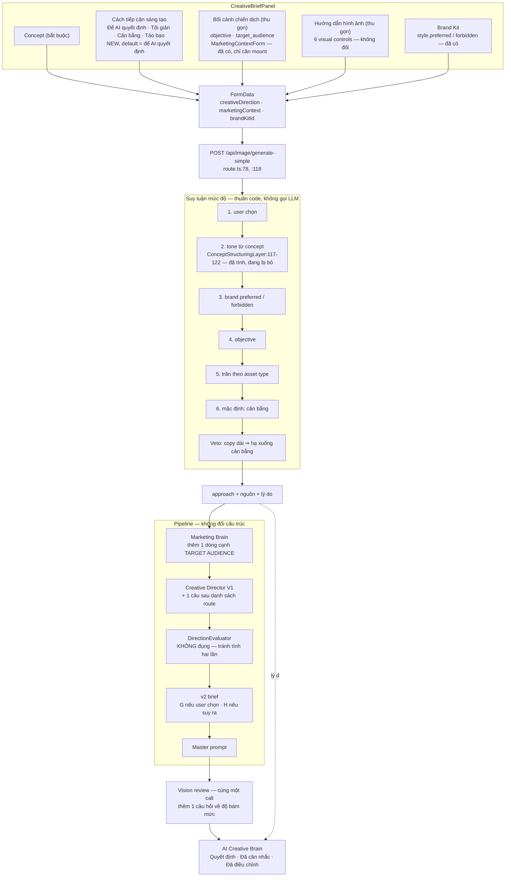

# 06 — Creative direction: how the system should know when to be restrained and when to be bold

Analysis only. **Nothing here is implemented.** No image or LLM API was called; every claim is
derived from the code, and anything that could not be established from it is marked **UNVERIFIED**.

Audit date 2026-10-06, on branch `feat/gpt-image-migration`. Paths are relative to
`tido-ai-video-factory-claude-code-pack/apps/web/` unless stated.

---

## Contents

0. [The short version](#0-the-short-version)
1. [How the system decides boldness today](#1-how-the-system-decides-boldness-today)
2. [Inputs that exist but are empty, dropped or unexposed](#2-inputs-that-exist-but-are-empty-dropped-or-unexposed)
3. [Brand Kit](#3-brand-kit)
4. [The existing precedence mechanism](#4-the-existing-precedence-mechanism)
5. [Inference when the user leaves it on "let the AI decide"](#5-inference-when-the-user-leaves-it-on-let-the-ai-decide)
6. [Conflict handling](#6-conflict-handling)
7. [How it reaches the prompt](#7-how-it-reaches-the-prompt)
8. [UI changes, minimal](#8-ui-changes-minimal)
9. [Feedback and review](#9-feedback-and-review)
10. [Tests and evaluation](#10-tests-and-evaluation)
11. [Risks](#11-risks)
12. [Recommendation](#12-recommendation)
13. [Decisions you must make](#13-decisions-you-must-make)

---

## 0. The short version

Three findings reshape the question you asked.

**F1 — Most of what you hypothesised already exists in code and is simply not on screen.**
`MarketingContextForm.tsx` already contains a target-audience field, seven industries, and
**four campaign objectives — one of which is literally `branding` = "Định vị Cao cấp (Luxury
Branding)"** (`features/picture-engine/components/brief/MarketingContextForm.tsx:26-30`). The
component is **never mounted**: `CreativeBriefPanel.tsx` imports five children and this is not one
of them (`:13-18`). The store holds the fields (`stores/picture-engine.store.ts:90-93`), the
client serialises them (`services/picture-engine.api.ts:92`, `:161`), the server parses them
(`app/api/image/generate-simple/route.ts:78`, `:216-219`), and the pipeline reads them
(`ExperimentPipeline.ts:1174-1175`). The wire is complete end to end; only the control is absent.
That is why the panel prints "Chưa nhập đối tượng cụ thể"
(`components/strategy/AIStrategyPanel.tsx:73`).

**F2 — The route is chosen partly at random, and 40% of the scoring weight is being fed nothing.**
The candidate routes are shuffled with `Math.random()` before the director sees them
(`evolution/experiment/AssetContext.ts:127-134`, called at `ExperimentPipeline.ts:1040`). The
evaluator then scores on six axes weighted product 0.25, **audience 0.20, objective 0.20**, brand
0.15, channel 0.10, feasibility 0.10 (`evolution/experiment/DirectionEvaluator.ts:137-144`), and a
missing verdict scores a neutral 0.5 (`:151-156`) — which discriminates between no routes at all.
With audience empty and objective empty, **two fifths of the decision is noise**, and the shuffle
decides the rest. That is the mechanism behind "it picked conceptual metaphor and I never asked
for that".

**F3 — A Vietnamese tone detector already exists, runs on the live path, and its output is thrown
away.** `director/ConceptStructuringLayer.ts:117-122` maps Vietnamese and English keywords to five
tones — `premium`, `energetic`, `minimal`, `bold`, `warm`. It is called on the live path at
`service/SimpleInputAdapterService.ts:317`, but only to infer copy *roles*; **no live code reads
`intent.tone`** (every reader found is under `benchmark/`, `campaign/` or `delivery/`).

So the smallest useful change is not a new feature. It is **exposing fields that already exist and
reading a signal that is already computed.**

---

## 1. How the system decides boldness today

### 1.1 The chain

| Step | Where | What it does |
|---|---|---|
| Route catalogue | `evolution/experiment/AssetContext.ts:234-265` | Six fixed route options per asset type, e.g. poster: *iconic product composition*, *conceptual metaphor*, *editorial advertising*, *emotional storytelling*, *graphic-driven design*, *typographic poster* |
| **Shuffle** | `AssetContext.ts:127-134`, called `ExperimentPipeline.ts:1040` | `Math.random()` Fisher-Yates. The order the director sees is random |
| Offered to the LLM | `AssetContext.ts:419-427` | *"ROUTES THAT LEGITIMATELY SOLVE THIS FORMAT … They are alternatives, not a ranking, and the first is not the default"* |
| Director proposes | `evolution/experiment/CreativeDirectorV1.ts:1200` | One LLM call; returns directions with per-axis verdicts |
| Scored | `DirectionEvaluator.ts:137-144`, `:209-254` | Weighted sum of six axes, plus memory confidence, brand match/violation, text-violation penalties |
| Selected | `evolution/experiment/CreativeDirectionResolver.ts` | The winner becomes `creative_angle` |
| Into the prompt | v1: `compiler/MasterPromptCompilerService.ts:643`, `:776` | `CREATIVE ANGLE: …` |

### 1.2 Where a boldness concept already exists

| Concept | Where | Live? | Can the form or Brand Kit set it? |
|---|---|---|---|
| **tone**: `premium`, `energetic`, `minimal`, `bold`, `warm` | `director/ConceptStructuringLayer.ts:117-122` | Parsed on the live path (`SimpleInputAdapterService.ts:317`) | Only implicitly, from words in the concept — and **the result is never read** |
| **objective** incl. `branding` = Luxury Branding | `components/brief/MarketingContextForm.tsx:26-30`; type `CampaignObjective` at `types/picture-engine.types.ts:27` | Field flows to the brain (`ExperimentPipeline.ts:1175`, `:1532`) | **Component not mounted** |
| **brand preferred / forbidden styles** | `evolution/experiment/BrandKit.ts:30-37`; scored at `DirectionEvaluator.ts:265-276` | Yes — a route embodying a preferred style gains, one hitting a forbidden style is marked down | **Yes**, `BrandKitPanel.tsx:42-43` edits both |
| **information_density** per asset | `AssetContext.ts:141` (poster: *"Low. Anything that needs a second sentence is competing with the first"*) | Yes, in the brief text | Not settable |
| asset profile numbers (cap height, string count) | `evolution/experiment/AssetProfile.ts:58-92` | Yes | Not settable |

Grep counts across `lib/image-engine`, `app`, `features`, excluding tests and benchmarks:
`boldness` 0 files, `risk_level` 0, `creative_approach` 0, `minimalist` 4, `conservative` 5,
`intensity` 4, `restrained` 14, `tier` 41 (almost all unrelated — "tier-3 art direction", CSS
tiers), `tone` 56.

**Conclusion: there is no explicit boldness dial anywhere.** The nearest thing that works today is
`BrandKit.style.preferred / forbidden`, which is per-brand, free text, and only nudges the score.

### 1.3 Nothing in the templates pushes hard toward bold

Checked as asked. `prompt-v2/templates/` contains no occurrence of *dramatic*, *bold*, *striking*,
*unexpected* or *conceptual*. `system.v1.md:20-21` says *"ONE IDEA a viewer could retell in a
sentence. Reject the most obvious cliché for the category. **Quiet ideas are fine**, missing ideas
are not."* — balanced, with one mild tilt: "reject the most obvious cliché" argues against
*iconic product composition*, which is exactly the restrained route. Worth softening if a
restrained level is introduced, but it is not the cause of the problem.

The cause is §1.1: random order plus two empty axes.

---

## 2. Inputs that exist but are empty, dropped or unexposed

| Input | Control exists? | Mounted? | Sent? | Parsed? | Used? |
|---|---|---|---|---|---|
| `marketingContext.industry` | `MarketingContextForm.tsx:16-23` **and** inline in the panel (`CreativeBriefPanel.tsx:202`) | **Yes**, inline | yes | `route.ts:216-219` | yes |
| `marketingContext.objective` | `MarketingContextForm.tsx:26-30` | **No** | yes if set | `route.ts:78` | `ExperimentPipeline.ts:1175`, `:1532` |
| `marketingContext.target_audience` | `MarketingContextForm.tsx:97-98` | **No** | yes if set | `route.ts:78` | `ExperimentPipeline.ts:1174` → Marketing Brain `:253` |
| `marketingContext.target_channel` | store only (`store.ts:93`) | **No** | yes if set | yes | UNVERIFIED |
| `salesContext.product_name / offer_text / benefit / cta_text` | `SalesContextForm.tsx:34-79` | **No** | `api.ts:163` | `route.ts:123` | **Not read by the v2 brief** (plan §E) |
| `BrandKit.style.preferred / forbidden` | `BrandKitPanel.tsx:42-43` | **Yes** | via `brandKitId` | yes | `DirectionEvaluator.ts:265-276` |
| concept `tone` | derived, no control | — | — | `SimpleInputAdapterService.ts:317` | **computed and discarded** |
| copy density | derived | — | — | — | not computed as a signal |

### Why the panel says "Chưa nhập đối tượng cụ thể"

`AIStrategyPanel.tsx:73` renders `brief.marketing_context.target_audience || "Chưa nhập đối tượng
cụ thể"`. The value is always empty because the only control that writes it lives in a component
`CreativeBriefPanel` does not import (`:13-18`).

**What it would take to fill it: mounting one existing component.** No schema change, no new type,
no server change, no migration. The store field, the serialisation, the parse and the consumer all
exist.

---

## 3. Brand Kit

| Aspect | Finding |
|---|---|
| Type | `evolution/experiment/BrandKit.ts:26-42`: `name`, `colors[]` (hex + role), `fonts.{heading,body}`, `style.{preferred[], forbidden[], typography_preference?, references[]}`, `has_logo` |
| Validation | `normalizeBrandKit` (`:67+`) — everything optional except `name`; an unusable field is **dropped, not guessed** |
| Storage | A JSON document under `projects.brand_context -> 'brand_kit'`, with a partial index — `packages/infrastructure/migrations/0013_design_output.sql:29`, `:45-50`. **Schemaless**, so adding a field needs **no migration** |
| API | `app/api/brand-kits/route.ts`, `app/api/brand-kits/[id]/route.ts` — the only two routes in the app that **require** a signed-in user (they return 401) |
| UI | `components/brief/BrandKitPanel.tsx` — edits colours by role, both fonts, `preferred`, `forbidden`, `typography_preference`, logo |
| Reaches the render | as `brandKitId` in the FormData (`api.ts:153`), loaded server-side (`route.ts:94`) |
| Optional? | **Yes.** `brandKit` resolves to `null` when absent and a kit is explicitly "an assist, never a reason to fail a render" (`route.ts:286-288`) |

### Where brand tier and emotion keywords could live

`style.preferred` / `style.forbidden` are already free-text lists that **already affect route
scoring**. A tier could be a new optional key (`style.tier`), which the schemaless column accepts
without migration and `normalizeBrandKit` would drop for old kits — i.e. **backward compatible by
construction**.

But see §5: I do not recommend building tier. A user who wants restrained can write "tối giản,
sang trọng" into `preferred` today and it will already be scored.

---

## 4. The existing precedence mechanism

`director/VisualDirectionResolver.ts:19` states the order, implemented at `:98-187`:

```
user_selected > concept_detected > reference_image > ai_suggested > ai_decision > default
```

Six control keys: `camera, lens, lighting, composition, typography, color_mood`
(`director/visual-controls.types.ts:39-46`). Each option carries a user-facing `label` and a
professional `instruction` (`:74-82`). `ResolvedControl` records `source` and a `reason`
(`:356-367`).

This is a good mechanism and the UI already teaches it: every control reads "Tự chọn — để AI quyết
định" with a "reuse AI suggestion" link.

### Should "creative approach" be a seventh control?

| Option | Effort | Risk | Consistency |
|---|---|---|---|
| **A. Seventh control in the resolver** | Add a key, options, detection patterns; the panel renders it automatically | Medium — it is not a camera setting; it is the decision all six others serve. Burying it among six optical controls **understates it**, and the block is collapsed by default | High visually, **wrong hierarchically** |
| **B. A separate input fed to the brain and the director** | A field beside Concept; passed to Marketing Brain and into the brief | Low | Matches its importance: the user sees it before the collapsed block |
| **C. Both** | A top-level field whose resolved value is also exposed through the resolver's `source`/`reason` so the panel can say where it came from | Medium | Best, but only worth it once B exists |

**Recommended: B, with the resolver's `source`/`reason` convention copied rather than its
plumbing.** The creative approach governs the idea; the six controls govern how the idea is
photographed. Putting it inside a collapsed "Hướng dẫn hình ảnh" block makes the most consequential
decision the hardest to find.

One decisive technical detail for either option: **the v2 brief reads the RAW control ids, not the
resolved ones** — `ExperimentPipeline.ts:1364` passes `request.creativeDirection?.visual_controls`.
So on the v2 path, a `concept_detected` value would never reach the brief at all. Option A would
need that line changed too; option B would not.

---

## 5. Inference when the user leaves it on "let the AI decide"

### 5.1 Signal by signal

| Signal | Reliable? | Present in the live request? | Cost | Verdict |
|---|---|---|---|---|
| **Explicit user choice** | Total | Would be, if added | 0 | **Build** |
| **Objective** (`branding` / `promotion` / `conversion` / `awareness`) | High — a typed enum, not free text; `branding` is literally "Luxury Branding" | Field exists, **control unmounted** | 0 | **Build (mount)** |
| **Concept tone** (`premium`/`minimal`/`bold`/`energetic`/`warm`) | Medium — regex over Vietnamese and English | **Already computed** at `SimpleInputAdapterService.ts:317`, discarded | 0 | **Build (read what exists)** |
| **Brand Kit `style.preferred` / `forbidden`** | High when filled; free text | Yes, when a kit is attached | 0 | **Already works** — leave as is |
| **Copy density** (count + word count of the client's strings) | High as a *constraint*, weak as a taste signal | Derivable from `textRequirement.lines` | ~0 | **Build, as a veto only** (§6) |
| **Target audience** | Medium — free text, needs an LLM to interpret | Field exists, **control unmounted** | 0 to collect; the brain already reads it | **Mount it**, but do not use it for inference |
| **Industry** | Weak for boldness. Skincare runs from Aesop to Glossier | Yes | 0 | **Do not use for boldness.** Use for look (already in the playbooks) |
| **Asset type** | Weak-to-medium. `product_hero` genuinely caps boldness; the rest do not | Yes | 0 | **Use as a ceiling only**, not as a chooser |
| Brand tier (H4) | Would be high | Does not exist | New field + UI + migration thinking | **Do not build** — §5.3 |
| Emotion keywords (H5) | Medium, overlaps tone and `style.preferred` | Does not exist | New field + UI | **Do not build** |

### 5.2 Proposed precedence

```
1. explicit user choice                  → that level, full stop
2. concept tone detected, high confidence → premium/minimal ⇒ restrained; bold/energetic ⇒ bold
3. brand style.preferred / forbidden      → the existing penalty already biases the score
4. objective                              → branding ⇒ restrained; promotion ⇒ bold; others ⇒ balanced
5. asset type ceiling                     → product_hero caps at balanced
6. otherwise                              → balanced
```

Deterministic, free, no LLM call, and every step is already computed or one mount away.

### 5.3 Verdict on your hypotheses

| | Verdict | Evidence |
|---|---|---|
| **H1** single three-level control | **Build.** It is the one thing with no equivalent in the code — grep: `creative_approach` 0 files, `boldness` 0 | — |
| **H2** objective | **Build — it already exists.** Four typed options including `branding`, flowing to the brain and worth 0.20 of the route score. Mount the component | `MarketingContextForm.tsx:26-30`, `DirectionEvaluator.ts:140` |
| **H3** audience | **Mount it** (same component, same commit) — it is 0.20 of the score and is currently empty. But **do not infer boldness from it**: free text, needs an LLM to read | `:97-98`, `DirectionEvaluator.ts:139` |
| **H4** brand tier | **Do not build.** `style.preferred` already carries it, already affects scoring, already has an edit UI. A second overlapping field invites contradiction | `BrandKit.ts:30-37`, `DirectionEvaluator.ts:265-276` |
| **H5** emotion keywords + avoid | **Do not build.** `style.preferred` and `style.forbidden` are exactly this, per brand rather than per render | same |
| **H6** inference from existing signals | **Build, narrowly** — tone, objective, asset ceiling, copy-density veto. Not industry | §5.1 |

### 5.4 The smallest set that removes the ambiguity

1. **Mount `MarketingContextForm`** → objective and audience stop being empty. Fixes F2's two dead
   axes. *Zero new code.*
2. **One new field, three levels + "let the AI decide"** → the user can say it.
3. **Read the tone that is already computed** → the AI has a real reason when the user does not
   choose.

That is one mount, one field, and one line that stops discarding a value.

---

## 6. Conflict handling

Principle: **the user's explicit choice wins on taste; physics wins on legibility.**

| Case | Winner | Behaviour |
|---|---|---|
| "Restrained" + a very bold concept | **User's level**, concept supplies the subject | Restrained is a *treatment* instruction. The concept still decides what is in the frame. Record it in the decisions tag |
| "Restrained" + long dense copy | **The copy** | Restrained cannot mean large negative space when four lines must be legible. Demote to balanced, warn: *"Nội dung chữ dài nên bố cục không thể tối giản hoàn toàn."* This is the copy-density **veto** from §5.1 |
| Brand tier luxury + promotion objective | **Objective**, bounded by brand | Promotion needs an offer to be loud; luxury bounds *how*. Land on balanced and say so. This is a real campaign tension, not a bug |
| "Bold" + `product_hero` | **Asset type caps it** | A product hero's job is surface truth (`AssetContext.ts`, hero context). Cap at balanced, warn: *"Product Hero cần sản phẩm rõ ràng nên mức táo bạo bị giới hạn."* |
| User choice + Brand Kit `forbidden` hits the chosen route | **Brand Kit** | The existing penalty already handles this (`DirectionEvaluator.ts:268`); surface the reason |

**Every resolution must be shown, not silent.** The panel already has the surfaces: "Quyết định
thiết kế", "AI đã cân nhắc", "AI đã điều chỉnh". A demotion belongs in "AI đã điều chỉnh" with its
reason — that section exists precisely for this.

---

## 7. How it reaches the prompt

### 7.1 Binding points

| Layer | File | What binds |
|---|---|---|
| Marketing Brain | `llm/marketing-brain.service.ts:253` | add one line beside `TARGET AUDIENCE` |
| Director's route choice | `AssetContext.ts:419-427` | add one sentence after the route list narrowing which routes suit the level |
| Evaluator | `DirectionEvaluator.ts:209-254` | **leave alone.** It scores what the director returns; biasing here would double-count |
| **v2 brief** | `prompt-v2/brief-compiler.ts` → section **G (user visual choices)** when explicit, **H (strategy, advisory)** when inferred | The right split: an explicit level is binding; an inferred one is advice |
| v1 | `compiler/MasterPromptCompilerService.ts:643` | beside `CREATIVE ANGLE` |
| Playbooks | `prompt-v2/templates/playbooks/*.txt` | **do not** add the level here — a playbook is per asset type, the level is per render |

### 7.2 Wording style for the director

Three short paragraphs in the request template, one per level, only the active one inserted. Plain
visual language, no numbers (the Phase 3 rule), expressed as what changes:

> **Restrained.** One subject, nothing beside it. Most of the frame is empty and stays empty. Two
> colours at most, and the second is almost absent. Light is soft and comes from one direction. The
> words are small, quiet and few, set in the calmest part of the frame. No prop appears unless the
> product cannot be understood without it.

> **Balanced.** The product leads and one supporting element earns its place. A clear reading
> order: the picture, then the headline, then the rest. Light models the product and separates it
> from the background. Type is confident but does not compete with the subject.

> **Bold.** The idea may be carried by something the product is not. The composition can be
> asymmetric, close or unexpected. Strong contrast of light, scale or colour. Typography is part of
> the design rather than a label on it. One idea, pushed all the way — not several ideas at once.

### 7.3 One thing already pushing the other way

`system.v1.md:20-21`: *"Reject the most obvious cliché for the category."* Under restrained, the
obvious composition is often the right one. Suggested amendment **only when restrained is active**:
*"Under a restrained approach, the simplest composition is a legitimate answer; what must not be
generic is the execution."*

Nothing else in the templates biases toward boldness (§1.3).

---

## 8. UI changes, minimal

| File | Change |
|---|---|
| `features/picture-engine/components/brief/CreativeBriefPanel.tsx` | **mount `MarketingContextForm`**; add the approach control |
| `features/picture-engine/components/brief/MarketingContextForm.tsx` | none — already written |
| `features/picture-engine/stores/picture-engine.store.ts` | one field in `creative_direction` |
| `features/picture-engine/types/picture-engine.types.ts` | one union type |
| `features/picture-engine/schemas/creative-brief.schema.ts` | one optional zod enum |
| `features/picture-engine/services/picture-engine.api.ts` | nothing if the field sits inside `creative_direction` (already serialised whole at `:162`) |
| `app/api/image/generate-simple/route.ts` | nothing, same reason (`:118`) |
| persistence | nothing — Brand Kit is untouched |

### Placement

**Not inside the collapsed "Hướng dẫn hình ảnh" block.** Directly under Concept, since it modifies
the concept. Four options, default **"Để AI quyết định"**:

```
Cách tiếp cận sáng tạo
( ) Để AI quyết định        ← mặc định
( ) Tối giản & sang trọng
( ) Cân bằng
( ) Táo bạo & sáng tạo
```

When the AI decides, show the chosen level and its reason beside the control, matching the existing
"reuse AI suggestion" idiom.

`MarketingContextForm` should be mounted **collapsed**, labelled something like "Bối cảnh chiến
dịch (không bắt buộc)" — objective and audience are valuable but must not become a wall between
the user and the render button.

### Backward compatibility

The field is optional and absent means "let the AI decide", which is today's behaviour. Saved
projects and Brand Kits are unaffected because nothing is added to the kit.

---

## 9. Feedback and review

**Yes, the post-render review should check adherence — and it is free.**

The vision review already runs one call, already reads the image, and already returns structured
findings (`evolution/experiment/VisionAnalyzerService.ts:92`). Adding one question — *does the frame
match the stated approach?* — costs nothing extra: same call, slightly longer prompt.

It fits the advisory role it will have after the migration: the correction loop is dropped
(Phase decision 6), so this is a report, not a trigger.

One caution from the audit, still open: when the vision call fails, `worst()` returns 10 for an area
with no findings (`evolution/experiment/TypographyCritique.ts:302-319`), so a failed review scores
10/10. Phase 0 task 0.2 was to fix this; an approach-adherence score must land **after** that fix or
it will report perfect adherence on every failed call.

**"Cải thiện theo góp ý"** (`components/strategy/CreativeDirectionPanel.tsx:350`) **must** know the
approach — otherwise a user who chose restrained, and whose render came back busy, gets improvements
that push it further from what they asked for.

---

## 10. Tests and evaluation

### Free, deterministic

| Test | Proves |
|---|---|
| **Input sensitivity** — change only the approach, assert the brief changes in section G or H | The input is not dropped. This is the pattern already specified in plan §3.9 |
| **Golden briefs per level** — one brief fixture per level × asset type | The directive text is stable and reviewable in a diff |
| **Inference precedence** — a table test over (user choice, tone, objective, asset type) → expected level + reason | The precedence of §5.2 is honoured, including every §6 conflict case |
| **Conflict veto** — restrained + 60-word copy ⇒ demoted to balanced with a reason | The copy veto fires |
| **Mount regression** — `CreativeBriefPanel` renders a `target_audience` control | F1 cannot silently regress |

### Paid, if any

**One comparison, 6 images, ~900 VND at 150 VND** (text-only; a render carrying a product reference
is 250 VND — measured in `03-provider-capabilities.md`, so with a product it is ~1,500 VND):

> One concept × one asset type × three levels, twice (two different concepts).

That answers the only question the free tests cannot: *do the three levels actually look different,
and does restrained look restrained?* Anything larger is not worth it before the levels are tuned.

**Do not** build a multi-variant feature to evaluate this — explicitly out of scope, and the
comparison above is a one-off eval script, not a product capability.

---

## 11. Risks

| # | Risk | Severity | Mitigation |
|---|---|---|---|
| R1 | **Prompt bloat.** One more block in an already long brief | Low | One paragraph, only the active level inserted |
| R2 | **Contradiction with `system.v1.md:20-21`** ("reject the obvious cliché") under restrained | Medium | §7.3 — conditional sentence |
| R3 | **Over-asking.** Four new visible fields turns a simple form into a brief form | **High** | Approach visible; objective and audience collapsed and optional. Never block the render button |
| R4 | **A default that makes things worse.** If inference defaults to restrained, every render gets quieter than today | Medium | Default to `balanced`, which is closest to today's behaviour; and inference only moves off balanced on a *strong* signal |
| R5 | **Double-counting.** Biasing both the director's choice and the evaluator's score | Medium | Bind at the director and the brief only; leave `DirectionEvaluator` alone (§7.1) |
| R6 | **Interaction with the GPT-Image migration** | Medium | §11.1 |
| R7 | **UNVERIFIED: does the level actually change the image?** Everything here is prompt-level; Sunburst may not honour it | Medium | The paid comparison in §10 is the only answer |

### 11.1 Interaction with `feat/gpt-image-migration`

| Can be done **independently now** | Must **wait** for the migration |
|---|---|
| Mounting `MarketingContextForm` — UI only, no engine file | The v2 brief binding, because `prompt-v2/gpt-brief.ts` **does not exist yet** (Phase 3 not started) |
| The store/type/schema field | The GPT-dialect request template and its sections B/G/H |
| The inference function and its tests — pure, no engine dependency | — |
| Reading `intent.tone` instead of discarding it | — |

**Expected merge conflicts:** `CreativeBriefPanel.tsx` (Phase 5 of the migration also edits it, for
the model selector that was later cut from scope — check before assuming), `store.ts` and
`picture-engine.types.ts` (Phase 0.1 already touched both for the 4:5 removal, in commit `e24d9b1`).
All small and textual.

**Recommended sequencing: do this work on the same branch, after Phase 3 of the migration**, so the
brief binding is written once against the GPT dialect rather than twice. The UI mount (§12 option 1)
is the exception and can land immediately.

---

## 12. Recommendation

### Option 1 — Mount what exists *(smallest)*

**Change:** mount `MarketingContextForm` in `CreativeBriefPanel`, collapsed.
**Files:** 1. **Effort:** under an hour. **Risk:** very low.
**Gain:** objective and audience stop being empty, so **0.40 of the route score starts carrying
information** (`DirectionEvaluator.ts:139-140`), and the "Luxury Branding" objective becomes
selectable — which is already most of a restrained signal. The AI Creative Brain panel stops saying
"Chưa nhập đối tượng cụ thể".
**Does not give:** a direct way to say "I want this simple and luxurious" for *this one render*.

### Option 2 — Option 1 + the approach field + deterministic inference *(recommended)*

**Change:** everything in Option 1, plus one four-way control under Concept; a pure inference
function over the §5.2 precedence; read `intent.tone` instead of discarding it; bind the directive
in the Marketing Brain line, the route-list sentence, and the v2 brief (section G when explicit, H
when inferred); surface the chosen level and its reason in the existing panel.
**Files:** ~8 — `CreativeBriefPanel.tsx`, `store.ts`, `picture-engine.types.ts`,
`creative-brief.schema.ts`, a new inference module + its test, `marketing-brain.service.ts`,
`AssetContext.ts`, and the GPT request template.
**Effort:** a few days including tests. **Risk:** low-medium (R2, R4).
**Gain:** the user can say it; the system has a defensible reason when they do not; and both are
visible in the panel.

### Option 3 — Option 2 + brand tier and emotion keywords in the Brand Kit *(largest)*

**Change:** `style.tier`, `style.emotions[]`, `style.avoid[]`, the kit UI, normalisation, and the
inference weighting.
**Files:** ~12. **Effort:** roughly double Option 2. **Risk:** medium — overlaps
`style.preferred`/`forbidden`, which already work and are already scored.
**Gain:** marginal over Option 2.
**Not recommended.**

### Recommended: **Option 2**, with Option 1 landing first as its own commit

Option 1 alone is worth shipping immediately because it is one mount and it repairs a measurable
defect (two dead scoring axes). Option 2 then answers the actual request. Option 3 duplicates a
mechanism that already exists.



---

## 13. Decisions you must make

| # | Decision | My recommendation |
|---|---|---|
| 1 | Ship Option 1 (mount `MarketingContextForm`) now, before anything else? | **Yes.** One file, repairs two dead scoring axes, no engine risk |
| 2 | Three levels, or two ("tối giản" vs "táo bạo" with balanced as the unnamed default)? | **Three named levels.** "Cân bằng" being invisible would make the default feel like an absence |
| 3 | Vietnamese labels for the three levels? | "Tối giản & sang trọng" · "Cân bằng" · "Táo bạo & sáng tạo" — matching the words you used |
| 4 | Default when the user does not choose: `balanced`, or inferred? | **Inferred, starting from balanced.** Only a strong signal (explicit tone word, `branding`/`promotion` objective) moves it, and the panel always says why |
| 5 | Build brand tier in the Brand Kit (H4)? | **No.** `style.preferred`/`forbidden` already do this and are already scored |
| 6 | Build emotion keywords + avoid (H5)? | **No.** Same reason |
| 7 | Mount `SalesContextForm` too? | **Not yet.** Four of its fields are not read by the v2 brief at all (plan §E). Mounting it would collect data nothing uses |
| 8 | Run the paid three-level comparison (§10), ~900–1,500 VND? | **Yes, but after the directive text is written** — it is the only way to learn whether the levels actually look different |

### Still UNVERIFIED

- Whether GPT-Image-2.5-Sunburst honours a restraint directive at all. Nothing in the code can
  answer this; only §10's comparison can.
- Whether `marketing_context.target_channel` is read anywhere downstream.
- Whether the director LLM's route choice shifts measurably when `audience` and `objective` are
  populated — plausible given they are 0.40 of the weight, but unmeasured.
- Whether `Math.random()` shuffling (`AssetContext.ts:127`) is desirable once the axes carry
  information. It exists to stop the first route becoming the default; with real signals it may
  simply add variance. Worth revisiting, not in this scope.
